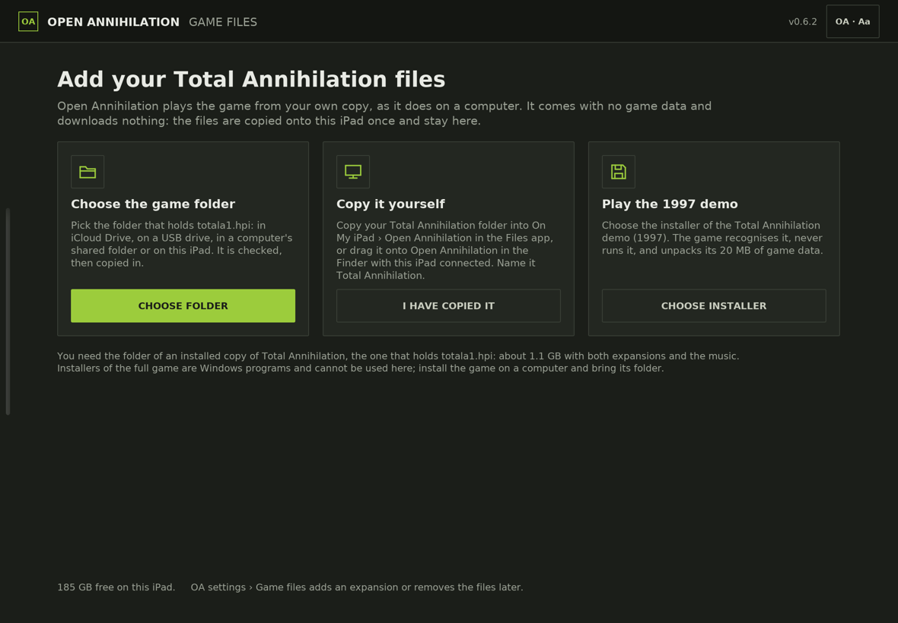
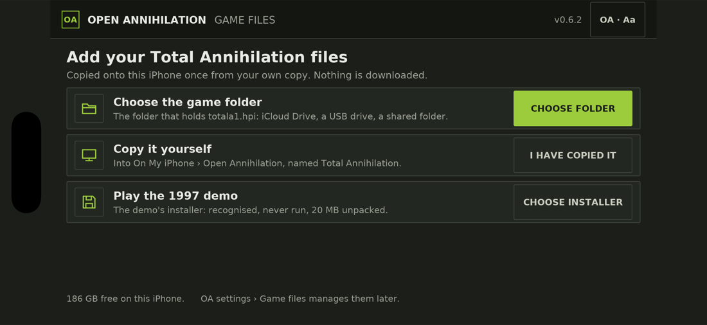
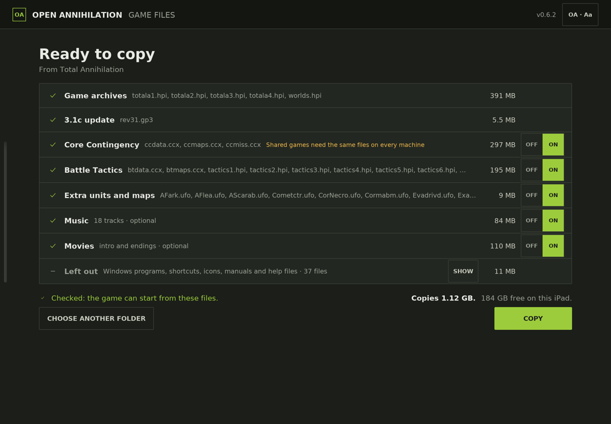
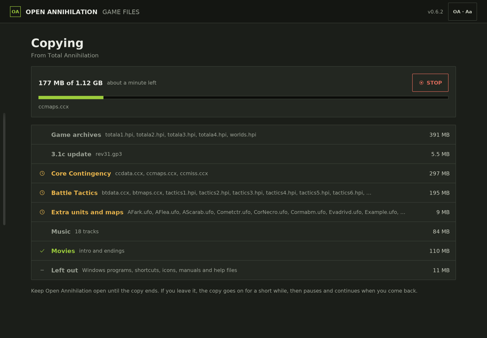
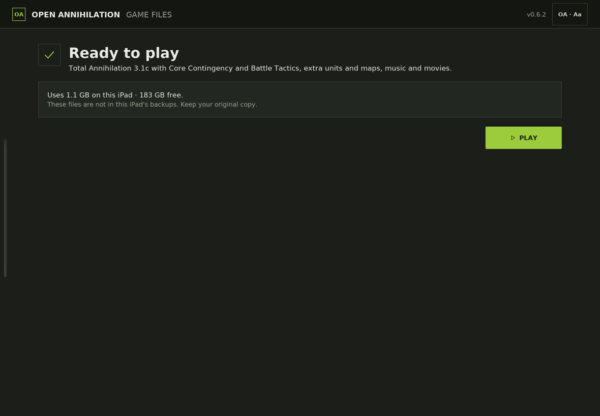
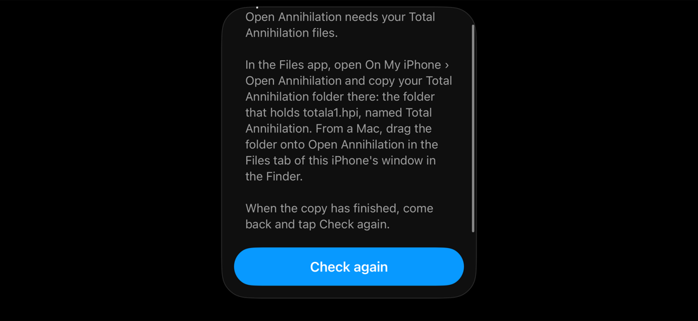
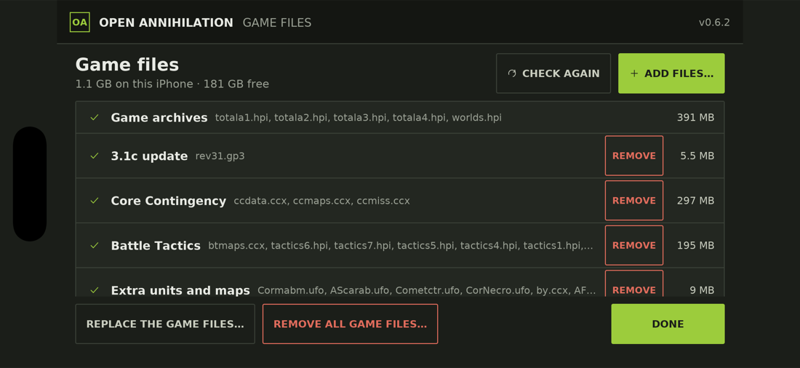

# Installing on iPhone and iPad

Open Annihilation has no App Store release. You build the app yourself on a
Mac and install it on your own iPhone or iPad. No game data is included: you
also need the game data from your own copy of Total Annihilation, which the
app copies in on its first start (step 7).

## 1. What you need

- **A Mac** with Xcode 26 or later, from the Mac App Store. Open Xcode once
  after installing it, so that it installs its components.
- **An Apple ID.** A free Apple ID works: sign in with it in Xcode, under
  **Xcode › Settings › Accounts**. Xcode then makes a personal team for it.
  An app signed by a personal team stops opening after seven days, and you
  build and install it again. With a paid Apple Developer Program
  membership the app keeps opening for a year.
- **An iPhone or iPad** with iOS or iPadOS 15 or later, and its cable, or a
  device that is paired with the Mac over the same Wi-Fi network.
- **Your Total Annihilation folder**: an installed copy of the game with the
  3.1 update, the folder that holds `totala1.hpi`. With both expansions and
  the music it is about 1.1 GB. [Installing on macOS](macos.md#3-get-the-game-data)
  explains where to find it.
- **About 2 GB free** on the device: the game data and a margin for saves.

## 2. Install the tools

Open Terminal and run:

```sh
xcode-select --install
```

Then install CMake and Ninja, for example with [Homebrew](https://brew.sh):

```sh
brew install cmake ninja
```

Python 3 comes with Xcode's command line tools.

## 3. Get the source

```sh
git clone https://github.com/open-annihilation/open-annihilation.git
cd open-annihilation
python3 tools/bootstrap_text_fonts.py --fonts-only
```

The first build also fetches and builds the libraries the game needs for
iOS. It builds them once.

## 4. Make the Xcode project

Find your team ID: in Xcode, open **Xcode › Settings › Accounts**, choose
your Apple ID and read the team's ID. Then run, from the `open-annihilation`
folder:

```sh
platforms/ios/scripts/xcode.sh --device --team <your team ID> --open
```

This makes an Xcode project in `build-ios-xcode` and opens it.

### Where the game data comes from

The game looks for its data in this order:

1. The folder **Total Annihilation** in the game's own folder on the device
   (On My iPhone or On My iPad › Open Annihilation in the Files app). The
   **Game files** screen puts it there on the first start (step 7).
2. A copy of your game folder built into the app.

For a test device you can build your game folder into the app instead. Set
it once in the project's configuration before you build:

```sh
cmake -B build-ios-xcode -DOA_IOS_BUNDLED_GAME_DIR="$HOME/Games/Total Annihilation"
```

Use the path of your own Total Annihilation folder. The app is then about
1.1 GB larger and takes longer to install, but it plays as soon as it is
installed. Without this setting, add the game files on the first start, as
step 7 describes.

## 5. Build and install

1. Connect the iPhone or iPad to the Mac and unlock it. The first time,
   tap **Trust** on the device.
2. In Xcode, choose the **oa-game** scheme and your device in the toolbar.
3. If Xcode reports that the app's identifier is not available, open the
   **oa-game** target, choose **Signing & Capabilities**, and change
   **Bundle Identifier** to one of your own, for example
   `net.yourname.open-annihilation`.
4. Choose **Product › Run**.

## 6. Allow the app on the device

The first time, the device refuses to open an app from your own team:

1. **Developer Mode** (iOS and iPadOS 16 and later): open **Settings ›
   Privacy & Security › Developer Mode**, turn it on and restart the device
   when it asks.
2. **Trust your developer profile:** open **Settings › General › VPN &
   Device Management**, choose your Apple ID under Developer App and tap
   **Trust**.

Then open **Open Annihilation** from the Home Screen.

## 7. Add your game files

Skip this step if you built your game folder into the app.

The first time you open Open Annihilation it shows the **Game files**
screen. It offers three ways to bring your Total Annihilation files onto
the device. Whichever you choose, the files are checked, and the app never
closes for lack of them.



On an iPhone the three ways in are rows:



### Choose the game folder

1. Put your Total Annihilation folder (the one that holds `totala1.hpi`)
   where the device can reach it: in **iCloud Drive**, on a USB drive, in a
   shared folder of a computer on your network (connect to it in the Files
   app first), or on the device itself.
2. Tap **CHOOSE FOLDER**. In the picker, tap **Browse**, find the folder,
   open it and tap **Open**.
3. The app looks at the folder (names and sizes only, so nothing is
   downloaded yet). If you chose a folder that holds your game folder
   further down, it offers that one.
4. **Ready to copy** shows what it found: the game's archives, the 3.1c
   update, Core Contingency, Battle Tactics, extra units and maps, music,
   the movies and any mods. The optional parts have switches, all on. It
   also says what it leaves out (Windows programs, shortcuts, icons,
   manuals and help files, which no game data uses; **SHOW** lists them),
   and how much space the copy needs against the space free.

   

5. Tap **COPY**. The copy shows its progress, the time left and the file
   it is on. Keep the app open until it ends: if you leave it, the copy goes
   on for a short while, then pauses and continues when you come back.
   Files that are only in iCloud are downloaded as they are copied.

   

6. The copy is checked with the game's own check, then **Ready to play**
   says what the game will play and the space it uses. Tap **PLAY**.

   

**STOP** asks whether to keep what was copied. If you keep it, or if the
copy is cut short, choose the same folder again later and the copy
continues: the files already copied are not copied again.

### Copy it yourself

Copy the folder onto the device yourself, then come back to the app:

- **With the Mac:** connect the device, select it in the Finder sidebar and
  open the **Files** tab. Drag your Total Annihilation folder onto
  **Open Annihilation**.
- **On the device:** in the Files app, copy the folder into **On My
  iPhone** (or **On My iPad**) › **Open Annihilation**.

Name the copied folder `Total Annihilation`. When the copy has finished,
tap **I HAVE COPIED IT**. If the folder has another name, or the archives
were copied loose into Open Annihilation's folder, the app finds them and
offers to put them in place.

### Play the 1997 demo

The free demo of Total Annihilation (1997) plays without the full game:

1. Download the demo's installer (a 21.5 MB Windows program, usually named
   `Total Annihilation.exe`) on the device, for example in Safari, which
   saves it in Files › Downloads.
2. Tap **CHOOSE INSTALLER** and choose the file, then **COPY**.

The app recognises the installer by its checksum, never runs it, and
unpacks its 20 MB of game data. Then tap **PLAY**.

### Device backups

The game files are kept out of the device's backups, which would otherwise
count about 1.1 GB against your iCloud storage. Keep your original copy:
after restoring the device from a backup, add the game files again.
**Include in device backups**, under Settings › Game files (see
[Managing the game files](#managing-the-game-files)), puts them back in.

### The older message: Check again

An app started with the launch option `--no-game-files-screen` (Xcode:
**Product › Scheme › Edit Scheme › Run › Arguments**) shows the message the
app had before the Game files screen instead. It says where to copy the
folder with the Files app or the Finder, and waits: copy the folder, then
tap **Check again**.



## 8. Play

Open **Open Annihilation**. The game is landscape only: turn the device on
its side. [touch-controls.md](../touch-controls.md) describes the
gestures and the layouts for phones and tablets. A keyboard, mouse or
trackpad connected to the device works as on a computer.

### Saves, screenshots and mods

Your saved games, screenshots, films and mods are kept in the Open
Annihilation folder in the game's own Documents folder: in Files, On My
iPhone (or On My iPad) › Open Annihilation › Open Annihilation, beside the
Total Annihilation folder. The buttons of **Common Tweaks › Your files**
in the OA settings, and **Open Mods Folder** on the **Mods** page, open the
Files app at its Saves, Screenshots or Mods folder; the Files app's status
bar leads back to the game. A mod copied into that Mods folder is offered
on the Mods page, and choosing it reloads the game for it without leaving
the app. A `.oamod` file installs itself there: tap it in the Files app, or
share it to Open Annihilation
([mods](../mods/README.md#installing-a-oamod-file)).

## Managing the game files

Open the **OA** settings from the main menu and choose **Game files**:

- what is installed, for example "3.1c · Core Contingency · Battle Tactics ·
  music", its size and the space free;
- **Include in device backups**, off by default (see
  [Device backups](#device-backups));
- where the files are: in Files, On My iPhone (or On My iPad) › Open
  Annihilation › Total Annihilation;
- **MANAGE…**, which opens the Game files screen to manage them:
  - **ADD FILES…** adds an expansion, extra maps or a mod from a folder,
    archives (`.hpi`, `.ufo`, `.ccx` and `.gp3` files) or the demo's
    installer. Nothing already there is replaced. A folder holding a mod
    profile (`oamod.yaml`) becomes a mod you choose on the settings' Mods
    page.
  - **CHECK AGAIN** runs the game's own check on the files, which also
    notices changes made in the Files app.
  - **REMOVE** next to a part removes it; **REMOVE ALL GAME FILES…** removes
    everything. Saved games and settings stay.
  - **REPLACE THE GAME FILES…** copies and checks a new folder first, as on
    the first start.
  - When a full game is installed after the demo, the demo's unpacked data
    can be removed.



Removals and replacements take effect from the next start of Open
Annihilation; the app says so when you tap **DONE**. A replaced folder is
kept as **Total Annihilation (old)** until you remove it, on Ready to play
or in the Files app.

## Network games

Network games on an iPhone or iPad play over the local network, as on a
computer. The first time the game uses the network, iOS asks whether Open
Annihilation may find and connect to devices on your local network: tap
**Allow**. If you tapped **Don't Allow**, turn it on later in **Settings ›
Privacy & Security › Local Network**.

Searching for games, by leaving the address empty on the TCP/IP screen, uses
broadcast messages. iOS lets an app send and receive broadcasts only when it
is signed with Apple's **multicast networking entitlement**:

- **Without the entitlement**, which is every build signed by a free Apple
  ID: join a game by typing the host's address on the TCP/IP screen. To host
  a game on the iPhone or iPad, the other players type its address. You find
  a device's address in **Settings › Wi-Fi**: tap the information button next
  to the network and read **IP Address**.
- **With the entitlement**, searching works as it does on a computer. Apple
  grants the entitlement to a paid Apple Developer Program team on request:
  sign in at [developer.apple.com](https://developer.apple.com) and send the
  Multicast Networking Entitlement Request, saying that the game finds other
  players' games on the local network by broadcast. Once your team has it,
  make the project with it:

  ```sh
  platforms/ios/scripts/xcode.sh --device --team <your team ID> --multicast-entitlement
  ```

  A team without the entitlement cannot sign a build that asks for it, so
  leave `--multicast-entitlement` out until Apple has granted it.

## Troubleshooting

| What you see | What to do |
|---|---|
| "This folder does not hold a Total Annihilation installation" | Choose the folder that holds `totala1.hpi` |
| "These files cannot be played" | The folder lacks part of the game, often `totala1.hpi`: **ADD THE MISSING FILES** from your original, or choose another folder |
| "This is not the demo's installer" | Choose the installer of the 1997 demo; installers of the full game are Windows programs, which the app never runs: install the game on a computer and copy its folder |
| "Not enough space" or "ran out of space" | Free up space in **Settings › General › iPhone (or iPad) Storage**, or turn off an optional part, then **CHECK AGAIN** or **CONTINUE**; what was copied is kept |
| "The copy stopped" | A drive, a shared folder or the network went away: connect again and tap **CONTINUE** |
| "The folder can no longer be read" | Choose the folder again; what was copied is kept |
| "No game folder yet" after **I HAVE COPIED IT** | Wait until the copy in the Files app or the Finder has finished, then **CHECK AGAIN** |
| The Game files screen opens again on a later start | The game folder was moved, renamed or damaged in the Files app, or the device was restored from a backup: the screen says why; add the files again |
| "Untrusted Developer" | Trust your developer profile, step 6 |
| The app stopped opening after a week | A free Apple ID signs for seven days: build and install again, step 5 |
| The copy or the install fails for space | Free space on the device: the game data and the app need about 2 GB |
| No games appear when searching for network games | Type the host's address on the TCP/IP screen, or build with the multicast networking entitlement (see [Network games](#network-games)) |
| A network game cannot connect at all | Allow the local network: **Settings › Privacy & Security › Local Network** |
| Signing fails with an entitlement error | Leave out `--multicast-entitlement` unless Apple has granted your team the multicast networking entitlement |

## Updating and removing

To update, run `git pull` in the `open-annihilation` folder and build and
install again (step 5). Your game files, saves and settings stay on the
device. To remove the game, press and hold its icon and choose **Remove
App**; that also removes the game files copied into its folder.

[platforms/ios/README.md](../../platforms/ios/README.md) describes the iOS
build in more detail, including running it in the iOS simulator and testing
the Game files screen there. [Game files](../game-files.md) describes the
screen itself.
