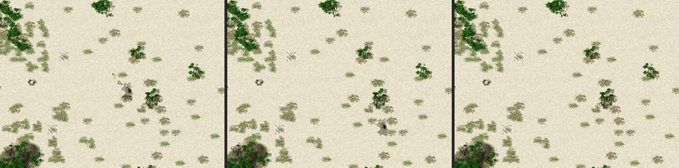
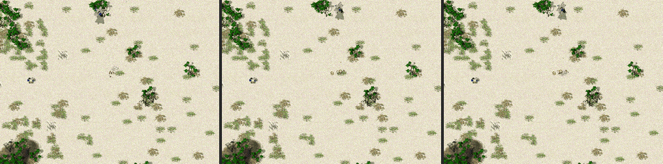
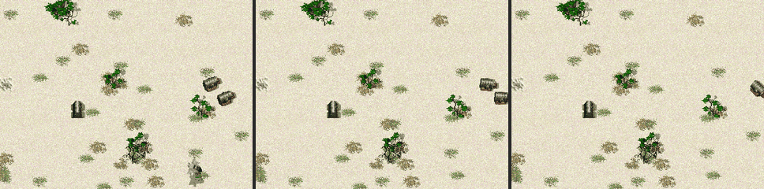
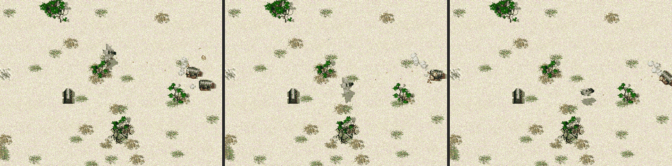

# Gunships Hover to Strafe

<!-- BEGIN GENERATED: facts -->
| Fact | Value |
| --- | --- |
| Hack id | `air.gunships-hover-to-strafe` |
| Area | Aircraft (`air`) |
| Scope | sim: part of the profile hash; every machine must agree |
| Runs on | The machine that owns the unit or player concerned. |
| Parameters | 2 |
| Status | implemented |
<!-- END GENERATED: facts -->

## Description

Aircraft that hover to attack (`HoverAttack=1`, such as the Brawler and the
Rapier) hover within weapon range of a point on the ground they are ordered
to attack, strafing from side to side and firing at it, as they already do
over an enemy unit. In 3.1c they make bomber-like runs at a point instead:
they fly over it, pull out three weapon ranges past it and come round for
the next run, firing only on the way in.

A gunship guarding a unit also goes after an enemy its weapons can reach and
hovers over it until it is destroyed, then guards again. In 3.1c a guarding
gunship circles the guarded unit and attacks only an enemy that hits that
unit; its fixed gun fires at other enemies only when its heading happens to
bring one into its arc.

Without the hack, ordered to attack the ground, a Brawler fires on its run
in, then pulls out of view and is gone for several seconds:



With the hack, it holds a position within range of the point and keeps
firing at it:



Without the hack, a Brawler guarding a construction vehicle circles it while
two enemy construction vehicles pass unharmed:



With the hack, it goes after them and destroys them:



## Configuration example

```yaml
hacks:
  air.gunships-hover-to-strafe: true
```

Only the attack on the ground:

```yaml
hacks:
  air.gunships-hover-to-strafe: {attack-ground: true, guard-engagements: false}
```

## Details

### Behaviour

`attack-ground`: the attack command on a point on the ground, or on a unit
of the gunship's own side, still gives the AirToGround order, so the order
and a saved game hold the same values as in 3.1c. Each step of that order
for a type with `HoverAttack` then runs as AirToGroundHover does over an
enemy unit: the gunship takes off, closes to half the distance on a heading
up to an eighth of a turn either side of the point, flies to within its
first weapon's range, and from then on strafes to alternate sides of the
point, two thirds of the range from it, an eighth of a turn either side of
its bearing, holding its heading toward the point at its cruise altitude.
Its first weapon stays aimed at the point (or at the unit of its own side).
The order ends as AirToGround does: on another command, or when a unit it
was aimed at is gone. A gunship below three quarters of its health still
breaks off for a repair pad.

`guard-engagements`: while it guards a unit (VTOL_Follow), a gunship that
would otherwise go on circling the guarded unit first looks for a target as
a patrolling aircraft does: an enemy its first weapon can reach, while its
fire order is Fire at Will and its move order is not Hold Position. If it
finds one it takes the attack a
patrolling aircraft takes, AirToGroundHover, with its move order's leash
and, on Maneuver, the move back to where it was; when that attack ends it
guards again. Defending the guarded unit, repairing it and joining its
builder's orders come first, as in 3.1c.

Bombers (`AirStrike`), fighters and every type without `HoverAttack` are
unchanged: a fighter ordered to attack the ground still makes runs at it.
A patrolling gunship already hovers over the enemies it finds in 3.1c, so
the hack leaves patrols as they are.

### 3.1c baseline

The command resolver gives an aircraft whose target is a point on the
ground, or a unit of its own side, AirStrike when its first weapon is
dropped and AirToGround otherwise; it does not look at `HoverAttack` there.
It gives AirToGroundHover only for an enemy unit. AirToGround flies at the
point, firing on the way in, pulls out three weapon ranges past it, swings a
quarter turn to one side and runs at it again.

VTOL_Follow searches for no enemies. It reacts only when the guarded unit is
hit: then it orders the attack command on the unit that hit it, which gives
a gunship AirToGroundHover, without a leash. Otherwise it circles the
guarded unit at its first weapon's range plus 160, taking a new point a
quarter turn and up to an eighth of a turn more around the circle each time
it arrives, or every 30 ticks. The Brawler's and the Rapier's guns do not
turn, so they hit enemies near the guarded unit only when the circle points
the gunship at them.

### Network games

The machine that owns the gunship applies the rule. The hack is part of the
profile hash, so every machine must run with the same setting, and a game
with it on cannot be played with 3.1c's own clients.

### Saved games

The hack adds no state: the orders keep their 3.1c kinds and fields. A game
saved with the hack on loads as any other; played on without the hack, a
gunship's attack on the ground goes back to making runs.

### Implementation notes

- The attack on the ground is in `hover_over_ground` in
  `src/sim/match-runtime/src/tick_missions_air.cpp`, which AirToGround runs
  when `MatchRules::air.gunships_hover_to_strafe` has `enabled` and
  `attack_ground` set and the type has `HoverAttack`.
- The guard engagement is `engage_in_reach` in
  `src/sim/match-runtime/src/tick_missions_vtol.cpp`.
- Tested in `src/sim/match-runtime/tests/attack_command_test.cpp` (ctest
  `match-attack-command-data`), with the installed Brawler and Rapier: a
  guard that defends as in 3.1c, a guard that goes after an enemy in reach,
  a gunship that hovers within range of a point and keeps firing, a fighter
  that still makes runs and a bomber that still bombs the point with the
  hack on, and a match that plays exactly as 3.1c with the hack off or with
  both parameters off.

## Full configuration schema

<!-- BEGIN GENERATED: schema -->
Hack id `air.gunships-hover-to-strafe`, written under the profile's `hacks` block.

| Write | Means |
| --- | --- |
| `air.gunships-hover-to-strafe: true` | On, every parameter at its default. |
| `air.gunships-hover-to-strafe: {attack-ground: true}` | On, the parameters named set and the rest at their defaults. |
| `air.gunships-hover-to-strafe: {preset: baseline}` | On, starting from a preset; parameters named beside `preset` replace its values. |
| `air.gunships-hover-to-strafe: false` | Off, the same as leaving it out: 3.1c behaviour. |

### Parameters

| Parameter | Type | Unit | Allowed | Length | Baseline (3.1c) | Default | Adjustable | Scope | Overridden by |
| --- | --- | --- | --- | --- | --- | --- | --- | --- | --- |
| `attack-ground` | `bool` | - | `true`, `false` | - | `false` | `true` | `fixed` | `sim` | - |
| `guard-engagements` | `bool` | - | `true`, `false` | - | `false` | `true` | `fixed` | `sim` | - |

Adjustable: `fixed`: only the profile sets it.

### Presets

| Preset | Values |
| --- | --- |
| `baseline` | `{attack-ground: false, guard-engagements: false}` |

`baseline` sets every parameter to its 3.1c value: the hack is on and plays as 3.1c.

### Shorthand

This hack takes no shorthand: write `true`, `false` or a parameter map.

### Every parameter at its default

```yaml
hacks:
  air.gunships-hover-to-strafe:
    attack-ground: true
    guard-engagements: true
```
<!-- END GENERATED: schema -->
