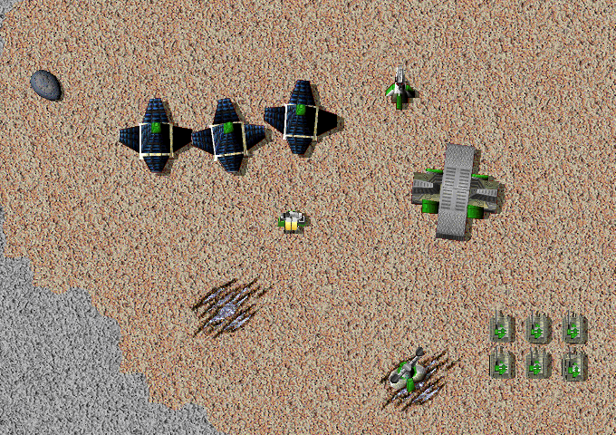
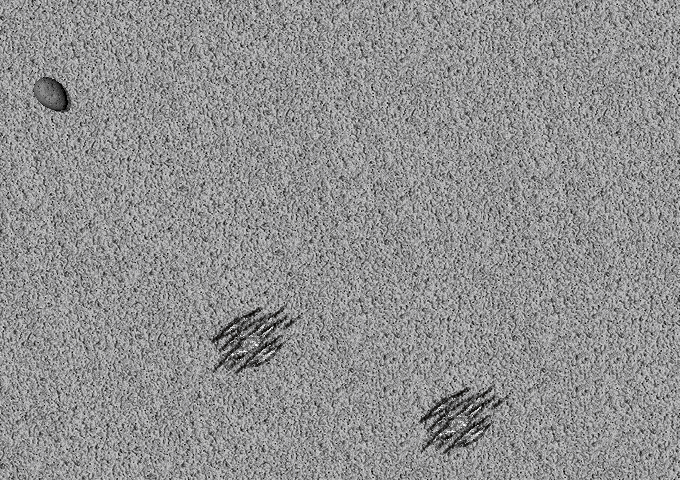

# Allied Line of Sight

<!-- BEGIN GENERATED: facts -->
| Fact | Value |
| --- | --- |
| Hack id | `intel.allied-los-sharing` |
| Area | Vision and Radar (`intel`) |
| Scope | sim: part of the profile hash; every machine must agree |
| Runs on | Each machine, for its own view. |
| Parameters | 0 |
| Status | implemented |
<!-- END GENERATED: facts -->

## Description

Allies share vision. When a player allies you, you see what that player's units see, get their radar and sonar coverage, and see their units even when cloaked or out of your own sight, without any shared-radar setting.



*With line of sight on, the ally's base and units stand clear of the gray fog because the ally shares its sight.*



*The same view with the hack off: the ally's base lies under the gray fog and its units are hidden.*

## Configuration example

```yaml
hacks:
  intel.allied-los-sharing: true
```

## Details

### Behaviour

Alliance is one-way: when player X allies player V, V gains X's vision, not the other way round.

- **Line of sight.** Each sight stamp of X's units is counted for every player whose row X's alliance row names, in player order, and then for X itself. Fog and radar are marked stale on every count.
- **Players on other machines.** A player another machine simulates is counted only while it is the viewpoint player; that applies to the owner too.
- **Owner quirk.** When the owner itself is not counted, the stamp stays recorded as owned by the last ally it was counted for. The rest of the same move or fresh stamp (its second count and its mapping) then goes to that ally, and later updates keep crediting it until the next rebuild.
- **Unit visibility.** A unit whose owner allies the player is visible to that player before the cloak and line-of-sight tests, so cloaked allied units are seen. The same test feeds computer players' lists of seen units, attack tracking, unit script effects, the on-screen unit list and the info panel.
- **Radar and sonar.** Every unit whose owner allies the viewer is a radar and sonar contact. The contact scan then runs once for each player whose row allies the viewer, in player order and the viewer among them, each pass as that player: their scanners, the jamming they see and their line of sight all add to one radar picture. Jamming found in a later pass clears contacts an earlier one made.
- **No units.** When the viewer owns no units, the scan runs once, for the viewer alone, and allies' radar is not merged.
- **Alliance changes.** At each player's deadline, before the viewpoint's scan, a changed alliance row or a changed viewpoint player rebuilds every sight stamp; mapped cells are kept.

### 3.1c behaviour

In 3.1c an alliance alone shares nothing. Radar is shared only when the shared-radar option is set; line of sight and the sight of cloaked units are never shared.

### Network games

Each machine works out its own view from the alliance rows every machine holds. The sight cells are part of the match state and its hash, so every machine must agree that the hack is on; it is part of the profile hash.

### Interactions

- [ui.allied-unit-display](ui.allied-unit-display.md) shows allied units on the minimap and panels.
- [intel.allied-jammers-ignored](intel.allied-jammers-ignored.md) decides which jammers jam during each pass of the merged scan.
- [teams.team-number-alliances](teams.team-number-alliances.md) and [teams.alliance-menu-all-game-types](teams.alliance-menu-all-game-types.md) set the alliance rows this hack reads.

### Implementation notes

- The match side is in `src/sim/match-runtime/src/intel.cpp` (`Match::add_allied_sight_state`, `Match::follow_alliances_in_sight`, `Match::owner_allies`), `src/sim/match-runtime/src/match.cpp` (`Match::unit_visible`, `Match::sight_context`) and `src/sim/match-runtime/src/tick_detection.cpp` (`Match::scan_contacts`). The alliance rows it followed are kept as the match rule state `intel.allied-sight`, saved and restored with the game.
- The stamps are (`SightContext::allied_vision`) in `src/sim/visibility-state/include/oa/sim/visibility_state.hpp` and `src/sim/visibility-state/src/visibility.cpp`.
- It reads the rules record field `rules.intel.allied_los_sharing.enabled`.
- Tests: `match-intel` (`src/sim/match-runtime/tests/intel_test.cpp`: `allied_vision_shares_sight`, `allied_vision_sees_allied_units`, `allied_vision_follows_alliances`, `allied_vision_rule_state`, `allied_vision_merges_radar`, `allied_vision_needs_a_viewer_with_units`, `allied_vision_jams_in_each_pass`) and `visibility-state` (`src/sim/visibility-state/tests/visibility_test.cpp`: `allied_vision_stamps`, `allied_vision_keeps_last_ally`).

## Full configuration schema

<!-- BEGIN GENERATED: schema -->
Hack id `intel.allied-los-sharing`, written under the profile's `hacks` block.

| Write | Means |
| --- | --- |
| `intel.allied-los-sharing: true` | On. |
| `intel.allied-los-sharing: false` | Off, the same as leaving it out: 3.1c behaviour. |

### Parameters

This hack has no parameters.

### Presets

This hack has no presets.

### Shorthand

This hack has no parameters to set: write `true` or `false`.

### Every parameter at its default

```yaml
hacks:
  intel.allied-los-sharing: true
```
<!-- END GENERATED: schema -->
