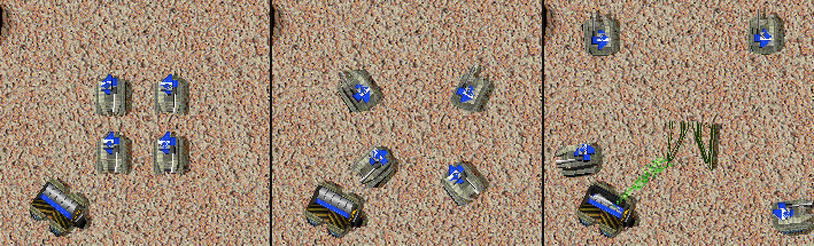

# Build Site Kickout

<!-- BEGIN GENERATED: facts -->
| Fact | Value |
| --- | --- |
| Hack id | `orders.build-site-kickout` |
| Area | Orders (`orders`) |
| Scope | sim: part of the profile hash; every machine must agree |
| Runs on | The machine that owns the unit or player concerned. |
| Parameters | 3 |
| Status | implemented |
<!-- END GENERATED: facts -->

## Description

Players can place buildings on top of their own units. A builder whose
site is blocked orders the player's own units off the footprint, and it
waits up to 20 times instead of 10 before giving up.



*A Construction Vehicle ordered to build a Solar Collector where its own tanks are parked: the tanks drive off the footprint (left to right: ticks 180, 250, 330) and the nanoframe starts once the site is clear.*

## Configuration example

```yaml
hacks:
  orders.build-site-kickout: true
```

```yaml
hacks:
  orders.build-site-kickout:
    kickout: false     # units are not moved; placement over them and the longer wait stay
    retry-limit: 40    # wait up to 40 times, about 40 seconds
```

## Details

### Behaviour

The hack has three independent parts, one for each parameter.

**`place-over-own-units`:** the build cursor accepts a site whose cells
are held by the placing player's own mobile units. These are units with
a movement object. Other players' units, and the player's own buildings,
still block the site. The engine reproduces one quirk of the cursor:
while this parameter is on, the unit in unit slot 1 never blocks the
cursor, whoever owns it.

**`kickout`:** each time a builder finds its site blocked, it orders
units off the footprint, the turned one for a building turned east or west
([units.build-rotation](units.build-rotation.md)). This applies to ground
builders and to builder aircraft. Only the local player's own mobile units
on the footprint's
cells move, and only those that meet one of these conditions:

- its current order is a move, and the move ends inside the footprint;
- it is idle, or its order has no target;
- its order targets a finished unit, or an unfinished one that has taken
  at least 600 energy of its build cost;
- its order targets an unfinished unit that has taken less than 600
  energy, and another of the owner's units is working on the same frame.

A unit working alone on a cheap frame stays.

Each moved unit goes to a free spot near the site. The search starts at
a radius of 24 world units per cell of the footprint's width. It widens
in steps of 16 to twice that radius. Each ring is walked outward on both
sides from a start angle, up to half a turn. A free spot keeps one cell
away from the map edges. The start angle is:

- for a unit the kickout already sent: random;
- for a unit headed for a target: an eighth of a turn off its course, on
  the side away from the site;
- for any other unit: straight away from the site's centre.

How the unit's orders change:

- an idle unit gets a move order;
- a unit the kickout already sent is sent on, and its later orders are
  kept;
- an order without a point gives way to the move;
- any other order stops and is given again from its start, behind the
  move, with the later orders kept. A builder whose frame has not
  started walks back to its site once it has moved.

The engine keeps, for each unit slot, whether the kickout sent that unit
and the point it was sent to. This table is part of the match state and
of saves.

**`retry-limit`:** a builder whose site stays blocked says
`Waiting for target area to clear` and waits 30 ticks (one second at
normal speed) between checks. Once it has waited more than `retry-limit`
times, it says `Target area was blocked` and the order fails.

### Baseline (3.1c)

Own units block the build cursor like any other unit. Nothing clears a
blocked site, and a blocked builder gives up after 10 waits.

### Network games

Placement and the kickout act only for units the local machine owns.
Each machine moves only its own player's units. Every machine must agree
on all three parameters, which are part of the profile hash.

### Interactions

- With [ui.build-tools](ui.build-tools.md), a site the build cursor
  accepts over the player's own units, which must move off before the
  building can start, is outlined in yellow. With the snap override key
  held (Alt unless the player chose another), the player can also drag one
  of their own units to a point: it goes there ahead of its orders, as the
  kickout sends a unit off a site, and while `kickout` is on the kickout's
  table keeps the point.
- [orders.con-patrol-guard-options](orders.con-patrol-guard-options.md)
  is tested together with this hack for builder aircraft. The two rules
  act independently.

### Implementation notes

- The rules record is `MatchRules::orders.build_site_kickout`
  (`OrdersBuildSiteKickout` in
  `src/data/match-rules/include/oa/data/match_rules/records.inc`), with
  the fields `place_over_own_units`, `kickout` and `retry_limit`.
- `Match::building_site` in `src/sim/match-runtime/src/tick_construction.cpp`
  applies the placement rule. The build cursor's site test is in
  `src/app/runtime_world_draw.cpp`.
- `GroundMissions::clear_build_site` in
  `src/sim/match-runtime/src/tick_missions_kickout.cpp` runs the kickout.
  `Match::keep_build_site_kickout` in the same file adds the rule-state
  table `build-site-kickout` (eight bytes per unit slot), only when
  `kickout` is on.
- The blocked-site waits are in
  `src/sim/match-runtime/src/tick_missions_build.cpp` (ground builders)
  and `src/sim/match-runtime/src/tick_missions_vtol_build.cpp` (builder
  aircraft).
- Tests:
  - `blocked_site_retries`, `kickout_clears_own_units`,
    `kickout_moves_off_costly_frames`, `aircraft_builders` and
    `drag_sends_units_ahead` in `match-order-rules`
    (`src/sim/match-runtime/tests/order_rules_test.cpp`).
  - `kickout_clears_the_turned_footprint` in `match-unit-rules`
    (`src/sim/match-runtime/tests/unit_rules_test.cpp`): a ground builder
    whose building is turned east clears the turned footprint and leaves a
    unit beside it.
  - `own_units_refuse_without_the_rule`, `own_units_pass_with_the_rule`
    and `other_parameters_leave_the_cursor_alone` in `match-build-cursor`
    (`src/sim/match-runtime/tests/build_cursor_test.cpp`).

## Full configuration schema

<!-- BEGIN GENERATED: schema -->
Hack id `orders.build-site-kickout`, written under the profile's `hacks` block.

| Write | Means |
| --- | --- |
| `orders.build-site-kickout: true` | On, every parameter at its default. |
| `orders.build-site-kickout: {place-over-own-units: true}` | On, the parameters named set and the rest at their defaults. |
| `orders.build-site-kickout: {preset: baseline}` | On, starting from a preset; parameters named beside `preset` replace its values. |
| `orders.build-site-kickout: false` | Off, the same as leaving it out: 3.1c behaviour. |

### Parameters

| Parameter | Type | Unit | Allowed | Length | Baseline (3.1c) | Default | Adjustable | Scope | Overridden by |
| --- | --- | --- | --- | --- | --- | --- | --- | --- | --- |
| `place-over-own-units` | `bool` | - | `true`, `false` | - | `false` | `true` | `fixed` | `sim` | - |
| `kickout` | `bool` | - | `true`, `false` | - | `false` | `true` | `fixed` | `sim` | - |
| `retry-limit` | `int` | attempts | `1` to `1000` | - | `10` | `20` | `fixed` | `sim` | - |

Adjustable: `fixed`: only the profile sets it.

### Presets

| Preset | Values |
| --- | --- |
| `baseline` | `{place-over-own-units: false, kickout: false, retry-limit: 10}` |

`baseline` sets every parameter to its 3.1c value: the hack is on and plays as 3.1c.

### Shorthand

This hack takes no shorthand: write `true`, `false` or a parameter map.

### Every parameter at its default

```yaml
hacks:
  orders.build-site-kickout:
    place-over-own-units: true
    kickout: true
    retry-limit: 20
```
<!-- END GENERATED: schema -->
