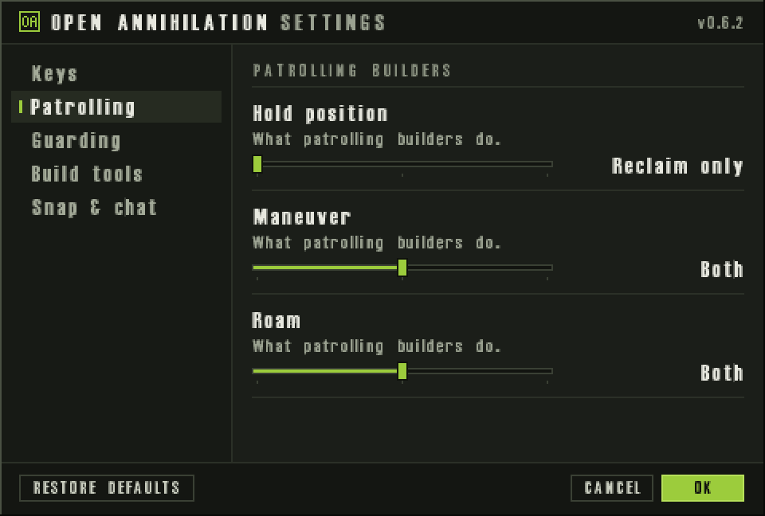

# Builder Patrol and Guard Options

<!-- BEGIN GENERATED: facts -->
| Fact | Value |
| --- | --- |
| Hack id | `orders.con-patrol-guard-options` |
| Area | Orders (`orders`) |
| Scope | sim: part of the profile hash; every machine must agree |
| Runs on | The machine that owns the unit or player concerned. |
| Parameters | 7 |
| Status | implemented |
<!-- END GENERATED: facts -->

## Description

Each player chooses, for each standing move order (Hold Position, Maneuver, Roam), what their patrolling builders look for: features to reclaim, units to repair and assist, or both. They also choose where guarding units stand: close, at the usual random spot, or at the full guard distance. 3.1c always looks for both and always stands at the random spot.



*The settings dialog's Patrolling section: what patrolling builders look for under each move order (Hold position, Maneuver, Roam).*

## Configuration example

```yaml
hacks:
  orders.con-patrol-guard-options: true   # patrolling builders on Hold Position only reclaim
```

Change the defaults the players start with:

```yaml
hacks:
  orders.con-patrol-guard-options:
    patrol-roam: assist-only     # roaming builders only repair and assist
    guard-hold-position: stay    # guards on Hold Position stand close to what they guard
```

## Details

The unit's standing move order picks which option applies: Hold Position, Maneuver and Roam each have a patrol option and a guard option.

**Patrolling builders (`patrol-*`).** A builder on patrol looks around within its sight distance each time its patrol pauses.

- `both`, as in 3.1c: it first looks for an allied unit to repair or a construction to assist (while its owner's energy is not low), then for features to reclaim (while its owner's metal or energy is low).
- `reclaim-only`: it skips the repair and assist search.
- `assist-only`: it skips the reclaim search.

The options apply to ground builders and to builder aircraft on patrol alike.

**Guarding units (`guard-*`, `guard-hook`).** A guarding unit follows the guarded unit and stands at an offset from it.

- `base`, as in 3.1c: the offset is the random one the order chose.
- `stay`: the whole-number parts of the offset's x and z become 7/20 of the guard spacing; their fractions stay.
- `scatter`: they become the whole guard spacing.

Each axis is signed toward the side of the guarded unit the guard stands on, and the order keeps the rewritten offset. Every guarding ground unit takes it, builder or not. The guard options apply only when `guard-hook` is true; with `guard-hook: false` every guard stands as in 3.1c, whatever the guard options say.

**Each player's own choice.** The profile's values are the defaults. While the hack is on, each player can change the six options in the mod options dialog (see [ui.options-dialog](ui.options-dialog.md)). The engine keeps them with the player's settings and puts them into the rules of every match that player starts. They apply only to that player's own units, so values can differ from player to player by design. `guard-hook` is the profile's alone. A standing move order outside the three keeps 3.1c's behaviour.

**Network games.** The machine that owns a unit runs its patrol and guard orders, so its owner's options decide. The profile's values and `guard-hook` are part of the profile hash; a player's own choices are not, since each machine applies only its own.

**Related hacks.** [air.guard-respects-hold-position](air.guard-respects-hold-position.md) changes what guarding aircraft do on Hold Position; [orders.build-site-kickout](orders.build-site-kickout.md) is another builder rule.

### Implementation notes

- The match runtime reads `rules.orders.con_patrol_guard_options` through `patrol_choice` and `guard_choice` in `src/sim/match-runtime/src/ground_missions.hpp`. The ground patrol search is in `src/sim/match-runtime/src/tick_missions_ground.cpp`, the aircraft patrol search in `src/sim/match-runtime/src/tick_missions_vtol_build.cpp`, and the guard offset in `src/sim/match-runtime/src/tick_missions_attack.cpp`.
- The player's options are read and written by `read_view_settings` and `write_view_settings` and put into the match's rules by `apply_builder_options` (`src/app/view_rules.cpp`). `src/app/runtime_skirmish_start.cpp` calls it when a match starts, and `src/app/runtime_engine_settings.cpp` shows the options in the dialog.
- Tests: `patrol_choices`, `guard_choices` and `aircraft_builders` in `src/sim/match-runtime/tests/order_rules_test.cpp` (ctest `match-order-rules`), and `view_settings_round_trip` and `options_dialog_round_trip` in `src/app/view_rules_test.cpp` (ctest `app-view-rules`).

## Full configuration schema

<!-- BEGIN GENERATED: schema -->
Hack id `orders.con-patrol-guard-options`, written under the profile's `hacks` block.

| Write | Means |
| --- | --- |
| `orders.con-patrol-guard-options: true` | On, every parameter at its default. |
| `orders.con-patrol-guard-options: {patrol-hold-position: reclaim-only}` | On, the parameters named set and the rest at their defaults. |
| `orders.con-patrol-guard-options: {preset: baseline}` | On, starting from a preset; parameters named beside `preset` replace its values. |
| `orders.con-patrol-guard-options: false` | Off, the same as leaving it out: 3.1c behaviour. |

### Parameters

| Parameter | Type | Unit | Allowed | Length | Baseline (3.1c) | Default | Adjustable | Scope | Overridden by |
| --- | --- | --- | --- | --- | --- | --- | --- | --- | --- |
| `patrol-hold-position` | `enum` | - | `reclaim-only`, `both`, `assist-only` | - | `both` | `reclaim-only` | `install` | `sim` | - |
| `patrol-maneuver` | `enum` | - | `reclaim-only`, `both`, `assist-only` | - | `both` | `both` | `install` | `sim` | - |
| `patrol-roam` | `enum` | - | `reclaim-only`, `both`, `assist-only` | - | `both` | `both` | `install` | `sim` | - |
| `guard-hold-position` | `enum` | - | `stay`, `base`, `scatter` | - | `base` | `base` | `install` | `sim` | - |
| `guard-maneuver` | `enum` | - | `stay`, `base`, `scatter` | - | `base` | `base` | `install` | `sim` | - |
| `guard-roam` | `enum` | - | `stay`, `base`, `scatter` | - | `base` | `base` | `install` | `sim` | - |
| `guard-hook` | `bool` | - | `true`, `false` | - | `false` | `true` | `fixed` | `sim` | - |

Adjustable: `fixed`: only the profile sets it; `install`: the player's settings may set it when the profile binds it under `settings`.

### Presets

| Preset | Values |
| --- | --- |
| `baseline` | `{patrol-hold-position: both, patrol-maneuver: both, patrol-roam: both, guard-hold-position: base, guard-maneuver: base, guard-roam: base, guard-hook: false}` |

`baseline` sets every parameter to its 3.1c value: the hack is on and plays as 3.1c.

### Shorthand

This hack takes no shorthand: write `true`, `false` or a parameter map.

### Every parameter at its default

```yaml
hacks:
  orders.con-patrol-guard-options:
    patrol-hold-position: reclaim-only
    patrol-maneuver: both
    patrol-roam: both
    guard-hold-position: base
    guard-maneuver: base
    guard-roam: base
    guard-hook: true
```
<!-- END GENERATED: schema -->
