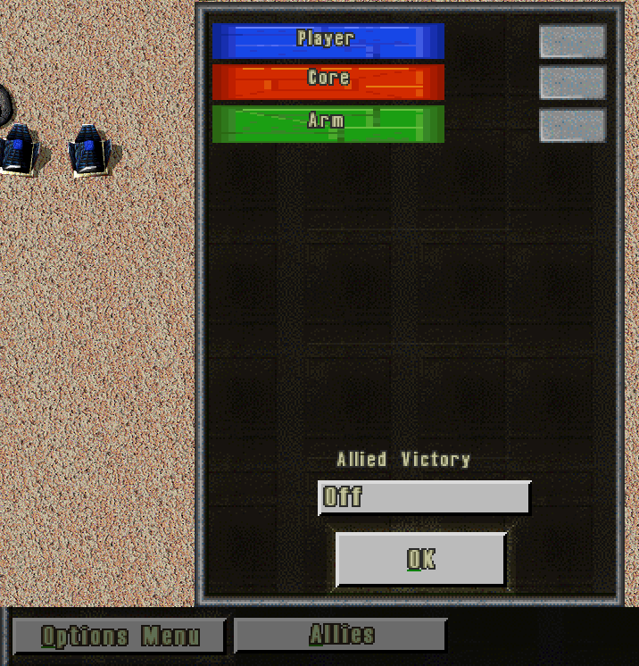

# Alliance Menu Everywhere

<!-- BEGIN GENERATED: facts -->
| Fact | Value |
| --- | --- |
| Hack id | `teams.alliance-menu-all-game-types` |
| Area | Teams (`teams`) |
| Scope | sim: part of the profile hash; every machine must agree |
| Runs on | The machine that owns the unit or player concerned. |
| Parameters | 0 |
| Status | implemented |
<!-- END GENERATED: facts -->

## Description

The Tab key opens the team menu in every game type, and its ALLIES button is offered there, so a
player can ally or unally computer players in a skirmish as well as in multiplayer. In 3.1c the team
menu belongs to multiplayer, and Tab opens the options panel in other games.



*In a skirmish, Tab opens the team menu, and its ALLIES button opens the alliance dialog listing the computer players.*

## Configuration example

```yaml
hacks:
  teams.alliance-menu-all-game-types: true
```

## Details

### Behaviour

- **Outside multiplayer** (skirmish and the other single-player game types), Tab opens the team menu
  instead of the options panel. The menu shows ALLIES; SHARE and CONTROL stay hidden. ALLIES opens
  the alliance panel, where the player sets alliances with the computer players.
- **Watchers** in a multiplayer game see ALLIES as well; SHARE and CONTROL stay hidden for them.
- **Seated players** in a multiplayer game see the menu as in 3.1c: ALLIES and SHARE when there is
  another player, and CONTROL for the host of a game that is not locked.
- **The game runs on** under the team menu and the alliance panel, in a skirmish as in multiplayer:
  3.1c holds a game played on one machine only for its options menu and the Pause key, so neither
  pauses it.

Without the hack Tab opens the options panel outside multiplayer, and a watcher's team menu offers
none of the three buttons.

### In a network game

Only the local player's machine applies it, as it handles that player's keys and panels. The hack is
part of the profile hash, so every machine agrees that it is on.

### Interactions

- [console.key-remaps](console.key-remaps.md): other changes to what keys do.

### Implementation notes

- `console_apply_rules` (`src/ui/console/src/commands.cpp`) sets `Console::team_menu_every_game`,
  which makes `hotkey_dispatch` open the team menu for Tab
  (`src/ui/console/include/oa/ui/console/console.hpp`).
- `Runtime::team_menu_every_game`, `toggle_team_menu` and `open_allies_team_panel` in
  `src/app/runtime_team_panels.cpp` allow the menu and the alliance panel outside multiplayer.
- `toggle_tab_menu` in `src/ui/hud/src/ingame_menu.cpp` shows the buttons
  (`allies_every_game`).
- It reads `MatchRules::teams.alliance_menu_all_game_types`.
- Tests: `ui-console` (`test_team_menu_every_game`) and `ui-hud-team-panels` (`test_tab_menu`).

## Full configuration schema

<!-- BEGIN GENERATED: schema -->
Hack id `teams.alliance-menu-all-game-types`, written under the profile's `hacks` block.

| Write | Means |
| --- | --- |
| `teams.alliance-menu-all-game-types: true` | On. |
| `teams.alliance-menu-all-game-types: false` | Off, the same as leaving it out: 3.1c behaviour. |

### Parameters

This hack has no parameters.

### Presets

This hack has no presets.

### Shorthand

This hack has no parameters to set: write `true` or `false`.

### Every parameter at its default

```yaml
hacks:
  teams.alliance-menu-all-game-types: true
```
<!-- END GENERATED: schema -->
