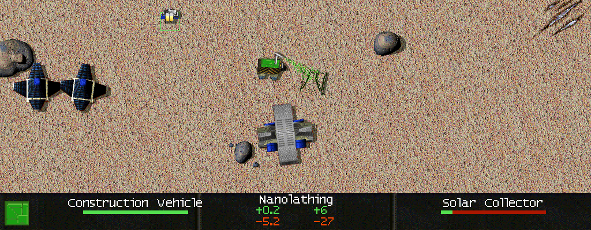
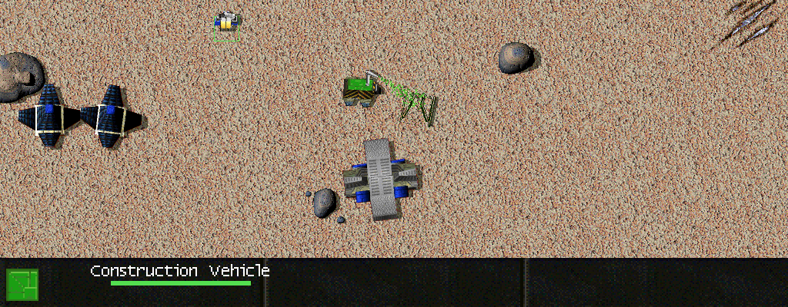

# Allied Unit Display

<!-- BEGIN GENERATED: facts -->
| Fact | Value |
| --- | --- |
| Hack id | `ui.allied-unit-display` |
| Area | Interface (`ui`) |
| Scope | view: local display only; each player may differ |
| Runs on | Each machine, for its own view. |
| Parameters | 0 |
| Status | implemented |
<!-- END GENERATED: facts -->

## Description

Units of players who ally the viewer show on the minimap as the viewer's own do, and the unit panel
shows for them what it shows for the viewer's own units: health (allied commanders included), rates,
kills, what the unit is doing and its target. In 3.1c an allied unit is shown like an enemy's.



*Hovering over an ally's Construction Vehicle: the unit panel shows its health, that it is nanolathing with its metal and energy rates, and the Solar Collector it is building with its progress.*



*The same hover with the hack off: as in 3.1c the allied vehicle is shown like an enemy's, with only its name and health bar: no order, no rates, no target.*

## Configuration example

```yaml
hacks:
  ui.allied-unit-display: true
```

## Details

### Behaviour

What counts is the owner's alliance with the viewer, not the viewer's with the owner: a unit is
shown as allied when its owner allies the viewing player. The viewer allying the owner alone shows
nothing more.

- **Minimap and full-screen map.** Units of such owners are drawn as the viewer's own, without
  needing radar or sight contact, also when sight is limited.
- **Unit panel.** For a unit of such an owner the panel shows its make and use rates, its kills and
  veterancy line, its current order, the target of its first order (name and damage bar) and its
  stockpile progress, and the damage bar of a type that normally hides it, such as a commander.

Without the hack only the viewer's own units are shown this way, as in 3.1c.

### In a network game

It is a view hack: each machine draws it for its own player, and the game's simulation does not
change. It is not part of the profile hash, so machines that differ on it still play the same
game.

### Interactions

- [intel.allied-los-sharing](intel.allied-los-sharing.md): shares allies' sight and radar; this
  hack shows allied units on the maps and the panel.
- [ui.veterancy-label](ui.veterancy-label.md): how the kill line is labelled.

### Implementation notes

- Minimap: `RadarContactHost::allied_units_shown`
  (`src/present/world-renderer/include/oa/present/world_renderer/world_radar.hpp`), set in
  `src/app/runtime_radar.cpp`; the full-screen map reads the rule in `src/app/runtime_megamap.cpp`.
- Unit panel: `UnitPanelHooks::allied_units_shown` (`src/ui/hud/include/oa/ui/hud/unit_panel.hpp`,
  `src/ui/hud/src/unit_panel.cpp`), set in `src/app/runtime_hud.cpp`.
- It reads the profile's `ui.allied_unit_display`.
- Tests: `world-radar` (`compose_allied_units`) and `ui-hud-unit-panel` (`test_allied_units`).

## Full configuration schema

<!-- BEGIN GENERATED: schema -->
Hack id `ui.allied-unit-display`, written under the profile's `hacks` block.

| Write | Means |
| --- | --- |
| `ui.allied-unit-display: true` | On. |
| `ui.allied-unit-display: false` | Off, the same as leaving it out: 3.1c behaviour. |

### Parameters

This hack has no parameters.

### Presets

This hack has no presets.

### Shorthand

This hack has no parameters to set: write `true` or `false`.

### Every parameter at its default

```yaml
hacks:
  ui.allied-unit-display: true
```
<!-- END GENERATED: schema -->
