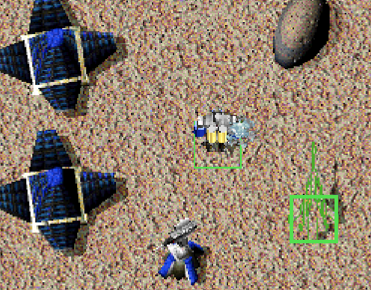
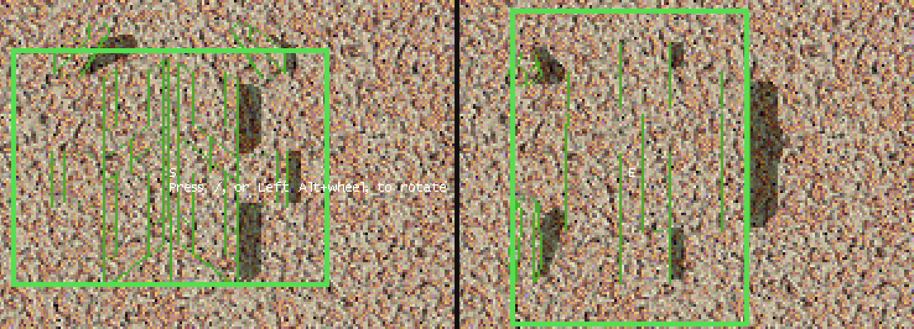

# Build Preview

<!-- BEGIN GENERATED: facts -->
| Fact | Value |
| --- | --- |
| Hack id | `ui.build-preview` |
| Area | Interface (`ui`) |
| Scope | view: local display only; each player may differ |
| Runs on | Each machine, for its own view. |
| Parameters | 1 |
| Status | implemented |
<!-- END GENERATED: facts -->

## Description

While the player places a building, it is drawn at its site as a
shimmering nanoframe. A building type that may face more than one way can
be turned before it is placed, and is then built facing that way; a type
may also have its preview turned toward the nearest enemy. 3.1c shows
only the footprint and builds every building facing south.



*Placing a Light Laser Tower: the tower is drawn at its site as the player's shimmering nanoframe, inside its footprint outline.*



*Turning a Vehicle Plant before placing it. Left: the preview faces south, shows its facing letter S and the hint "Press /, or Left Alt+wheel, to rotate". Right: after one press of /, the plant and its footprint face east and the site shows E; the hint is gone, as it is once the player has turned a building.*

## Configuration example

```yaml
hacks:
  ui.build-preview: true
```

```yaml
hacks:
  # The preview's build sweep covers the whole model, not only its top.
  ui.build-preview:
    fill: true
```

Buildings turn only with [units.build-rotation](units.build-rotation.md),
which gives each type its facings:

```yaml
hacks:
  ui.build-preview: true
  units.build-rotation: true
```

## Details

### The preview

- In build mode, the building being placed is drawn at the site the cursor
  points to, or at the snapped site when [ui.click-snap](ui.click-snap.md)
  moves the click. It is drawn as the local player's nanoframe, facing the
  chosen way.
- The nanoframe's build sweeps again every second. With `fill` the sweep
  covers the whole model; without it only the model's top fifth, which
  leaves its outline shimmering.
- No preview is drawn while the line or ring tool of
  [ui.build-tools](ui.build-tools.md) is laying buildings.
- A unit type's preview keys choose what is drawn:
  - `PreviewPieces` lists the pieces drawn, separated by commas and matched
    without case; `PreviewPiecesS`, `PreviewPiecesE`, `PreviewPiecesN` and
    `PreviewPiecesW` give the list for one facing and come first. Without
    either, every piece is drawn.
  - `PreviewObject3D` names another model, `objects3d/<name>.3DO`, drawn
    instead of the type's own. A model that cannot be read leaves the type's
    own.
  - `PreviewFaceOpponent` turns the preview toward the nearest enemy (see
    below).

### Turning a building

- The rotate key (`/` unless the player chose another), pressed without
  Ctrl, or the snap override key (Alt) with the mouse wheel, turns the
  building to the next facing its type allows, stepping south, east, north,
  west. The wheel steps forward or back. Each turn plays the `MORE` sound.
- South is always allowed; the other facings are the ones the type's
  facings name (the `units.build-facings` data key of
  [units.build-rotation](units.build-rotation.md)), and only for a type
  that rule lets face another way: a building whose yard map covers its
  footprint and that is no wider or deeper than 32 cells. A type that
  allows only south, such as a unit that moves, does not turn.
- For east and west the footprint's sides swap. The facing's letter, S, E, N
  or W, shows at the site.
- The site is tested, and its height taken, with the building turned to the
  chosen facing, so the outline and the click follow the turned footprint.
  The line and ring tools of [ui.build-tools](ui.build-tools.md) lay the
  turned footprint too.
- The build order carries the facing, and the builder builds the building
  facing that way. Computer players place every building facing south.
- A saved game keeps a building's facing once it has started, but not the
  facing of a build order whose building has not: after loading, that
  building is built facing south.
- Until the player has turned a building once, the hint "Press /, or
  Alt+wheel, to rotate" shows, with the keys the player chose. Once a
  building is turned, the player's settings remember that and the hint no
  longer shows.

### Facing the opponent

- A type whose `PreviewFaceOpponent` key is set (to an odd number, such as
  1) is drawn turned toward the nearest enemy, as the finished defence would
  turn, while its site lies within build distance of one of the player's
  selected, finished units that can move and have a build distance. A unit
  in the last slot of the player's block of unit slots is not counted.
- The enemies are, for each other player in use who is neither a watcher
  nor allied with the player, that player's first unit (normally the
  commander), when it can move. The one nearest the site's centre counts;
  of two as near, the one in the lower player slot.
- The preview faces east or west when that unit lies farther off across
  than down, otherwise south when it lies south of the site and north when
  it does not.
- Only the preview turns. The footprint, the facing letter, the site test
  and the build order keep the facing the player chose.
- Without such a unit of the player's, or without such an enemy, the
  preview keeps the chosen facing.

### Network games

The preview and the keys change only this player's view and input; nothing
needs to agree between machines. The facing a building is built in goes
with the build order and is placed by
[units.build-rotation](units.build-rotation.md), a game rule every machine
must agree on, and the other machines read it from the building's heading.

### Interactions

- [ui.click-snap](ui.click-snap.md): the preview stands at the snapped site.
- [ui.build-tools](ui.build-tools.md): no preview is drawn while a line or
  ring is laid, and the tools lay the turned footprint and order every
  building in the chosen facing.
- [units.build-rotation](units.build-rotation.md) gives each type its
  facings and builds the building in the order's facing; without it every
  type faces south and nothing turns.

### Implementation notes

- The application reads `ModProfile::ui.build_preview` (`enabled`, `fill`)
  and each type's preview keys from the unit data (`read_unit_preview_keys`
  in
  [src/data/defs/src/rule_keys.cpp](../../../src/data/defs/src/rule_keys.cpp)).
- `Runtime::ready_build_preview`, `Runtime::rotate_pending_build`,
  `Runtime::handle_build_tool_key`, `Runtime::pending_build_facings`
  (from `Match::build_facings`), `Runtime::pending_build_facing` and
  `Runtime::pending_build_footprint` in
  [src/app/runtime_view_rules.cpp](../../../src/app/runtime_view_rules.cpp)
  prepare the preview, turn the building and give its turned footprint.
  `Runtime::render_match_surface`
  ([src/app/runtime_match_render.cpp](../../../src/app/runtime_match_render.cpp))
  draws the preview. `Runtime::pending_build_site`, `Runtime::draw_build_ghost`
  and `Runtime::draw_build_facing` in
  [src/app/runtime_world_draw.cpp](../../../src/app/runtime_world_draw.cpp)
  test the site turned (`BuildSiteOptions::facing`) and draw its outline,
  letter and hint.
- The decisions are in [src/app/view_rules.cpp](../../../src/app/view_rules.cpp):
  `facing_allowed`, `next_build_facing`, `facing_letter`, `rotate_hint`,
  `preview_lists_piece`, `build_preview_remaining`, `facing_toward` and
  `opponent_facing`.
- The build click, `Runtime::place_pending_build_at`
  ([src/app/runtime_match_hud.cpp](../../../src/app/runtime_match_hud.cpp)),
  passes the facing to `Match::issue_mobile_build`
  ([src/sim/match-runtime/src/tick_orders.cpp](../../../src/sim/match-runtime/src/tick_orders.cpp)),
  which keeps it in the construction order.
- Tests:
  - `app-view-rules` (`build_facings`, `build_preview_helpers`,
    `facing_toward_points` and `opponent_facings` in
    `src/app/view_rules_test.cpp`): the facings and the hint, the sweep
    and the piece lists, and the opponent's facing: build distance,
    selected and finished builders, the last unit slot, watchers, allies
    and enemies without a movement object.
  - `defs-rule-keys` (`preview_keys_are_kept_as_text` in
    `src/data/defs/tests/rule_keys_test.cpp`) reads the preview keys.
  - `match-unit-rules` (`builder_builds_in_the_order_facing` and
    `buildings_turn_with_the_rule` in
    `src/sim/match-runtime/tests/unit_rules_test.cpp`): a builder builds in
    the facing given with the build order, or set after it, and only the
    facings a type may take are offered.
  - `native-render-tiers-visual-rules`, which needs the game's data
    (`Runtime::check_visual_rule_overlays`): in both render tiers, at
    several zooms, the building being placed is drawn into the scene
    around its site's middle at the scene's draw scale.

## Full configuration schema

<!-- BEGIN GENERATED: schema -->
Hack id `ui.build-preview`, written under the profile's `hacks` block.

| Write | Means |
| --- | --- |
| `ui.build-preview: true` | On, every parameter at its default. |
| `ui.build-preview: {fill: false}` | On, the parameters named set and the rest at their defaults. |
| `ui.build-preview: false` | Off, the same as leaving it out: 3.1c behaviour. |

### Parameters

| Parameter | Type | Unit | Allowed | Length | Baseline (3.1c) | Default | Adjustable | Scope | Overridden by |
| --- | --- | --- | --- | --- | --- | --- | --- | --- | --- |
| `fill` | `bool` | - | `true`, `false` | - | `false` | `false` | `fixed` | `view` | - |

Adjustable: `fixed`: only the profile sets it.

### Presets

This hack has no presets.

### Shorthand

This hack takes no shorthand: write `true`, `false` or a parameter map.

### Data keys

These data keys are read only while the hack is on:

| Data key | File | Usual key | Overrides |
| --- | --- | --- | --- |
| `ui.preview-pieces` | unit | `PreviewPieces` | - |
| `ui.preview-pieces-by-facing` | unit | `PreviewPieces{S,E,N,W}` | - |
| `ui.preview-object` | unit | `PreviewObject3D` | - |
| `ui.preview-face-opponent` | unit | `PreviewFaceOpponent` | - |

### Every parameter at its default

```yaml
hacks:
  ui.build-preview:
    fill: false
```
<!-- END GENERATED: schema -->
