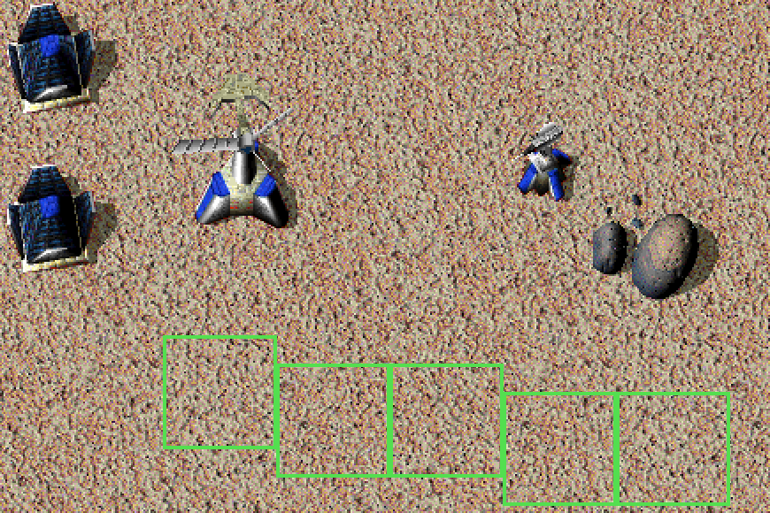
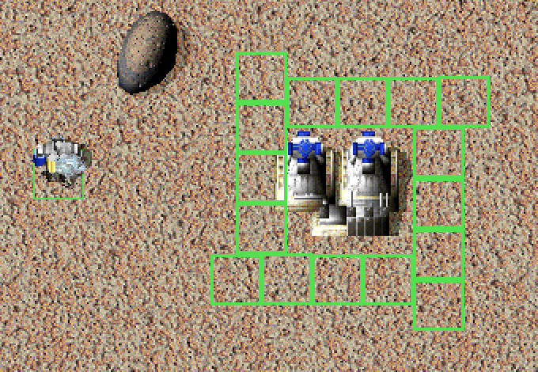
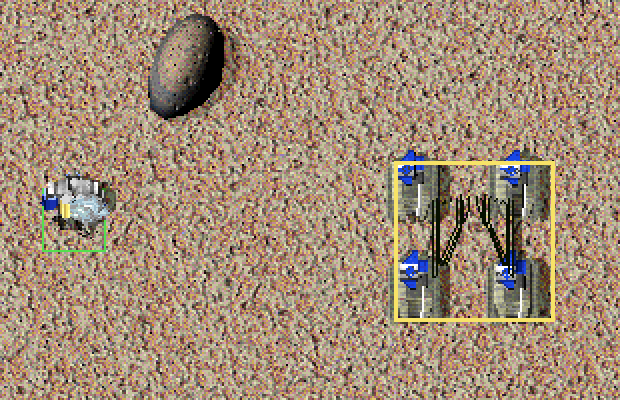

# Build Tools

<!-- BEGIN GENERATED: facts -->
| Fact | Value |
| --- | --- |
| Hack id | `ui.build-tools` |
| Area | Interface (`ui`) |
| Scope | view: local display only; each player may differ |
| Runs on | Each machine, for its own view. |
| Parameters | 0 |
| Status | implemented |
<!-- END GENERATED: facts -->

## Description

In build mode, holding the autoclick key lets the player lay a line of
buildings with two clicks, or a ring of buildings around a unit with one.
A site the player's own units must leave is outlined in yellow, and
holding Alt lets the player drag one of their own units to a spot it goes
to before carrying on with its orders. 3.1c places one building per click
and has neither.



*Laying a line of Wind Generators: with the autoclick key (X) held, a click starts the line and the pointer drags it out as a row of footprints, one cell sideways per step as the line slants.*



*A ring of Dragon's Teeth around a Fusion Reactor: with the autoclick key held, pointing at the building lays out the whole ring, placed with one click.*



*A Solar Collector site over four of the player's own parked Stumpy tanks is outlined in yellow: the tanks will have to leave before it goes up.*

## Configuration example

```yaml
hacks:
  ui.build-tools: true
```

The hack has no parameters. The keys and the line options are the
player's own settings.

The yellow outline needs a build cursor that accepts sites over the
player's own units:

```yaml
hacks:
  ui.build-tools: true
  orders.build-site-kickout: true   # place-over-own-units is on by default
```

## Details

### Lines

- In build mode, with the autoclick key held (X unless the player chose
  another), a click starts a line at the cursor. When
  [ui.click-snap](ui.click-snap.md) snaps the click, the line starts at the
  snapped site's middle cell.
- The line follows the cursor. Along the axis that spans more cells (the
  vertical one on a tie), it steps a whole footprint plus the spacing for
  each building, as many whole steps as fit. Along the other axis it moves
  one cell at a time, spread over the steps as a straight line spreads
  them. The cells are the pixel differences divided by 16, rounded toward
  zero.
- A line of more than 999 buildings after its first is not laid; the line
  laid before stays.
- The next click gives the line: one queued build order for each building,
  in order. It also starts the next line at that click.
- Letting the autoclick key go drops the line without giving it.
- When the player's Optimize DT option (`OptimizeDT`) is on, a line of 2 by 2
  buildings is given as a staggered double row: walking from the second
  building, where the next but one, or else the next, stands in the same
  row across the line, the two swap places in the order.

### Rings

- With the autoclick key held and no line started, pointing at a unit lays
  a ring of buildings around its footprint, widened by the spacing on every
  side. A click gives it.
- The ring's top row runs left to right, its right column top to bottom,
  its bottom row right to left and its left column bottom to top, each
  outside the rectangle. Each side holds the rectangle's side divided by the
  footprint's, plus one.
- With the player's Full Rings option (`FullRings`), a side the footprint
  does not divide gets one more building, closing the corner, for a
  footprint smaller than 3 by 3.

### Spacing

While the autoclick key is held, the mouse wheel, Page Up and Page Down
change the spacing, the extra cells left between buildings, from 0 to 10.
The autoclick key itself types nothing while it builds.

### Turned buildings

With [ui.build-preview](ui.build-preview.md) the player may turn a
building before placing it. The line and ring tools then lay the turned
footprint, its width and depth swapped for a building facing east or
west, and every building of the line or ring is ordered in the chosen
facing. A ring around a building that itself faces east or west follows
that building's turned footprint.

### Yellow outline

- When the build cursor accepts a site only because the units standing on
  it are the player's own units that can move, which must leave before
  the building goes up, the site's outline is drawn in interface colour
  14, yellow, instead of the usual colour 10.
- The cursor accepts such sites only with the `place-over-own-units`
  parameter of [orders.build-site-kickout](orders.build-site-kickout.md);
  with its `kickout` parameter the builder also orders those units off.
  Another player's unit, or one of the player's own buildings, still
  refuses the site, which keeps the refusal colour.
- Every building of a line or ring is outlined the same way.

### Dragging a unit with Alt

- With the snap override key held (Alt unless the player chose another),
  a left press on one of the player's own units that can move picks it
  up, in build mode or not. The press does not change the selection.
- Letting the button go sends the unit to the ground under the pointer
  before its orders, as the build-site kickout sends a unit off a site:
  - an idle unit gets a move order;
  - an order without a point gives way to the move;
  - a unit the kickout already sent is sent on;
  - a builder whose frame has not started walks back to its site after
    the move;
  - any other order stops, and is given again from its start behind the
    move.

  The unit's later orders are kept. With the `kickout` parameter of
  [orders.build-site-kickout](orders.build-site-kickout.md) on, the
  kickout's table keeps the point, as for a unit the kickout sent.
- A press on another player's unit, or on a unit that cannot move, is an
  ordinary click. A release off the map sends nothing. Letting the snap
  override key go before the button drops the drag.

### Network games

The tools and the drag only decide where this player's build orders go
and where this player's own units move, as clicks do; the other machines
see the results as they see any of this player's units. Nothing needs to
agree between machines.

### Interactions

- [ui.click-snap](ui.click-snap.md) moves the start of a line to a snapped
  site's middle cell.
- [ui.build-preview](ui.build-preview.md) draws no preview while a line or
  ring is laid, and its facing turns the footprint the tools lay.
- [orders.build-site-kickout](orders.build-site-kickout.md): the yellow
  outline shows only where its `place-over-own-units` lets the cursor
  accept a site, and the drag sends a unit the way its kickout does.

### Implementation notes

- The application reads `ModProfile::ui.build_tools.enabled`, and the
  player's `KeyCode`, `OptimizeDT` and `FullRings` settings.
- `Runtime::build_tool_click`, `Runtime::build_tool_motion`,
  `Runtime::lay_build_tool`, `Runtime::give_build_tool_orders` and
  `Runtime::handle_build_tool_key` in
  [src/app/runtime_view_rules.cpp](../../../src/app/runtime_view_rules.cpp)
  run the tools; `Runtime::pending_build_footprint` in the same file gives
  the turned footprint. The layouts are `line_build_slots`,
  `ring_build_slots` and `optimize_dt_rows` in
  [src/app/view_rules.cpp](../../../src/app/view_rules.cpp).
- `Match::building_site` in
  [src/sim/match-runtime/src/tick_construction.cpp](../../../src/sim/match-runtime/src/tick_construction.cpp)
  reports a site it lets through over the player's own units
  (`BuildSiteOptions::over_own_units`). `Runtime::pending_build_site` and
  `Runtime::draw_build_site` in
  [src/app/runtime_world_draw.cpp](../../../src/app/runtime_world_draw.cpp)
  test the site and outline it in colour 14 for it.
- `Runtime::order_drag_pointer` in `runtime_view_rules.cpp` picks up and
  drops the dragged unit, and is called from `Runtime::handle_sdl_event`
  ([src/app/runtime_events.cpp](../../../src/app/runtime_events.cpp)).
  `Match::send_ahead_of_orders` in
  [src/sim/match-runtime/src/tick_missions_kickout.cpp](../../../src/sim/match-runtime/src/tick_missions_kickout.cpp)
  sends the unit through the kickout's own path
  (`GroundMissions::send_off_site`).
- Tests:
  - `app-view-rules` (`build_tool_layouts` in `src/app/view_rules_test.cpp`,
    and `view_settings_round_trip` for the settings).
  - `match-build-cursor` (`own_units_pass_with_the_rule` in
    `src/sim/match-runtime/tests/build_cursor_test.cpp`): the site test
    reports a site let through over the placing player's own unit, and
    leaves the report alone for an empty site.
  - `match-order-rules` (`drag_sends_units_ahead` in
    `src/sim/match-runtime/tests/order_rules_test.cpp`): an idle unit gets
    a move, a walking unit walks to its old point again after the move,
    another player's unit is not sent, and the kickout's table keeps the
    point under its rule.
  - `native-render-tiers-visual-rules`, which needs the game's data
    (`Runtime::check_visual_rule_overlays`): in both render tiers, at
    several zooms and with the view drawn between map pixels, the outlines
    of a line of three sites lie exactly over the sites as the frame draws
    them.
  - No test drives the yellow outline's colour or the drag through the
    running game.

## Full configuration schema

<!-- BEGIN GENERATED: schema -->
Hack id `ui.build-tools`, written under the profile's `hacks` block.

| Write | Means |
| --- | --- |
| `ui.build-tools: true` | On. |
| `ui.build-tools: false` | Off, the same as leaving it out: 3.1c behaviour. |

### Parameters

This hack has no parameters.

### Presets

This hack has no presets.

### Shorthand

This hack has no parameters to set: write `true` or `false`.

### Every parameter at its default

```yaml
hacks:
  ui.build-tools: true
```
<!-- END GENERATED: schema -->
