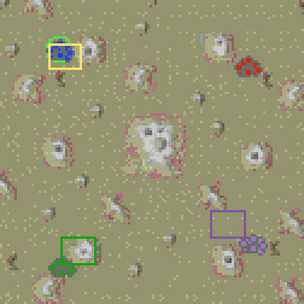

# Camera Sharing

<!-- BEGIN GENERATED: facts -->
| Fact | Value |
| --- | --- |
| Hack id | `ui.camera-sharing` |
| Area | Interface (`ui`) |
| Scope | view: local display only; each player may differ |
| Runs on | Each machine, for its own view. |
| Parameters | 0 |
| Status | implemented |
<!-- END GENERATED: facts -->

## Description

The minimap draws a rectangle for each allied player who shares their
camera position with this one, showing where they are looking, and a
watcher can lock their view onto a player's camera. 3.1c shows only the
local player's own view on the minimap.



*The minimap with the two allies' view rectangles (purple and green) beside the player's own (yellow); the enemy's reported view is not drawn.*

## Configuration example

```yaml
hacks:
  ui.camera-sharing: true
```

The hack has no parameters.

## Details

### Camera rectangles

- A player shares their map position with this machine while their
  machine sends its camera and they ally this machine's player. Only the
  sharer's alliance counts: this machine's player need not ally them back.
- The minimap draws one rectangle for each player slot from 1 to 9 that
  shares its map position with this machine, has sent a camera position,
  and has a name. A watcher sees every slot that has sent one, allied or
  not.
- Each rectangle is the size of this machine's view on the minimap,
  centred on the sent camera, and drawn in the slot's player colour.
- The same sharing decides which players a seated player's resource panel
  lists ([ui.resource-panel](ui.resource-panel.md)).

### Lock-on

A watcher can double-click a player's row in the resource panel of
[ui.resource-panel](ui.resource-panel.md) to view that player, and
double-click it again to lock the camera to the player's camera. While
locked, this machine's camera follows that camera as it arrives. A third
double-click, or the panel's own view button, unlocks it.

### How positions travel

In a network game where the game recorder is on
([recorder.ta-demo-recorder](recorder.ta-demo-recorder.md)), every machine
sends its own camera to every player, with the hack on or off:

- The camera goes as a 5-byte record: type `0xfc`, then the x and the y of
  the camera's centre in map pixels, each a little-endian 16-bit number
  from 0 to 65534.
- It is added to the frames the machine already sends: once the camera has
  been placed, and after that when it has moved, at most once each send
  interval.
- A player types `.sharemappos` in chat to stop sharing their camera, and
  again to share it once more. Sharing starts on. Stopping sends the record
  with both halves `0xffff` in a frame of its own; every machine that
  receives it forgets that player's camera, and the player's rectangle
  goes. Sharing again sends the camera with the next frame. Only the
  player who types the command changes; the line still goes out as chat.

Without the recorder no camera is sent or read, and no rectangles are
drawn. The machines do not need to agree on this hack: the rectangles and
the lock are this machine's view only.

### Implementation notes

- The application reads `ModProfile::ui.camera_sharing.enabled`.
  `Runtime::draw_shared_camera_rectangles` and
  `Runtime::follow_shared_cameras` in
  [src/app/runtime_view_panels.cpp](../../../src/app/runtime_view_panels.cpp)
  draw the rectangles and follow a locked camera. The rectangles come from
  `camera_rectangles` in
  [src/ui/hud/shared_views.hpp](../../../src/ui/hud/include/oa/ui/hud/shared_views.hpp),
  over the `SharedPlayerViews` record, which `take_reported_cameras` fills
  from the cameras received and the alliances.
- Each frame of a network match, `NetworkPlay::share_cameras` in
  [src/app/netgame/runtime_net.cpp](../../../src/app/netgame/runtime_net.cpp)
  passes `Runtime::camera_centre` to `net_match_note_camera`, and the
  cameras the match received to `Runtime::take_reported_cameras`.
- The match sends the camera from `net_match_after_tick` and
  `net_match_paused_frame`, keeps each remote player's camera in its
  recorder state (`handle_recorder_record`), and reads `.sharemappos` in
  `recorder_chat_line`, all in
  [src/netgame/match/src/net_match.cpp](../../../src/netgame/match/src/net_match.cpp).
- Tests: `ui-hud-shared-views` (which slots draw a rectangle, where, how
  large and in which colour, and which received cameras share a position),
  `ui-hud-resource-panel` (the lock), and `net-match` (sending, pacing,
  receiving and turning off a camera).
- Known limits: a recorded game played back does not show its recorded
  cameras, and `.lockon` typed in chat is only chat; the lock is taken from
  the resource panel.

## Full configuration schema

<!-- BEGIN GENERATED: schema -->
Hack id `ui.camera-sharing`, written under the profile's `hacks` block.

| Write | Means |
| --- | --- |
| `ui.camera-sharing: true` | On. |
| `ui.camera-sharing: false` | Off, the same as leaving it out: 3.1c behaviour. |

### Parameters

This hack has no parameters.

### Presets

This hack has no presets.

### Shorthand

This hack has no parameters to set: write `true` or `false`.

### Every parameter at its default

```yaml
hacks:
  ui.camera-sharing: true
```
<!-- END GENERATED: schema -->
