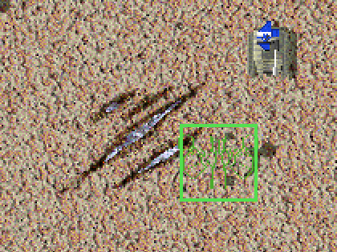
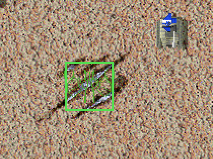

# Click Snap

<!-- BEGIN GENERATED: facts -->
| Fact | Value |
| --- | --- |
| Hack id | `ui.click-snap` |
| Area | Interface (`ui`) |
| Scope | view: local display only; each player may differ |
| Runs on | Each machine, for its own view. |
| Parameters | 4 |
| Status | implemented |
<!-- END GENERATED: facts -->

## Description

A build click with a metal extractor moves to the nearest metal spot,
and a reclaim click on empty ground moves to the nearest reclaimable
feature, each within a radius the player may choose; holding Alt places the
click exactly. 3.1c always uses the clicked cell.



*Without the snap, the Metal Extractor's preview sits where the pointer is, beside the metal patch.*



*With the snap (mex-default 4 cells), the same pointer position puts the Metal Extractor's preview on the metal patch.*

## Configuration example

```yaml
hacks:
  ui.click-snap: true
```

```yaml
hacks:
  # Extractors snap up to 3 cells by default; the player may choose up to 5.
  ui.click-snap:
    mex-default: 3
    mex-max: 5
```

## Details

### Radii

- `mex-default` and `wreck-default` are the radii, in cells, a player starts
  with; `mex-max` and `wreck-max` are the most a player may choose. A radius
  of 0 turns that snap off. Every radius is at most 9.
- The player's own choices (`MexSnapRadius`, `WreckSnapRadius` in the
  player's settings, or the options page of
  [ui.options-dialog](ui.options-dialog.md)) replace the defaults and are
  held to 0 and to the maxima.
- The defaults are `install` parameters: a profile may also bind them to the
  mod's own settings under `settings`.

### Building snap

While the snap override key (Alt unless the player chose another) is up:

- A building that extracts metal snaps, within the mex radius, to the place
  whose footprint holds the most cells richer than the map's surface metal.
  Of the best places, the one whose middle lies nearest the cursor wins; on
  a tie the first, taking the cells column by column from the most negative
  offset. A place that holds no such cell is never chosen.
- The snap is kept only when snapping again from the chosen place, with the
  larger side of the footprint as the radius, chooses the same place. When
  the best place is the cursor's own, it is kept as it is.
- A building whose yard map holds a geothermal cell instead snaps, within
  the mex radius, to the nearest place it may be built. Each place is
  tested with the building facing south, even when the player has turned it
  (see [units.build-rotation](units.build-rotation.md)). Only a move snaps
  the click. The yard map is read as text of at most 64 cells, so an open
  cell ends it: a geothermal cell that comes after an open cell is not seen.
- The building preview shows a snapped site as one that may be built on.

### Reclaim snap

- A reclaim click on ground with no feature snaps, within the wreck radius,
  to the nearest reclaimable feature that holds metal or energy. A click on
  a feature does not snap.
- When the snapped click queues an order that matches one already queued,
  the queued one is cancelled only when it lies from 8 whole pixels before
  to 7 after the click, on x and on z. An unsnapped click keeps 3.1c's reach
  of 16 pixels either way.

### Network games

The snap changes only where this player's click lands. The order it gives
reaches the other machines as any order does, so each player may choose
their own radii and nothing needs to agree between machines.

### Interactions

- [ui.build-tools](ui.build-tools.md) starts a line at a snapped site's
  middle cell.
- [ui.build-preview](ui.build-preview.md) draws the preview at the snapped
  site.
- With [ui.build-tools](ui.build-tools.md) on, a left press with the snap
  override key held on one of the player's own mobile units drags that unit
  ahead of its orders instead of placing the click. With
  [ui.build-preview](ui.build-preview.md) on, the key held with the wheel
  turns the building being placed.

### Implementation notes

- The application reads `ModProfile::ui.click_snap` (`enabled`,
  `mex_default`, `mex_max`, `wreck_default`, `wreck_max`).
- `Runtime::snapped_build_site` and `Runtime::snapped_reclaim_point` in
  [src/app/runtime_view_rules.cpp](../../../src/app/runtime_view_rules.cpp)
  find the snapped click with `snap_cell`, `click_snap_radius` and
  `yard_has_geothermal_cell` from
  [src/app/view_rules.cpp](../../../src/app/view_rules.cpp). The narrower
  cancel reach is `Match::cancel_queued_order` in
  [src/sim/match-runtime/src/tick_orders.cpp](../../../src/sim/match-runtime/src/tick_orders.cpp),
  called with the snapped click from
  [src/app/runtime_pointer_press.cpp](../../../src/app/runtime_pointer_press.cpp).
- Tests: `app-view-rules` (`click_snap_search`, `view_settings_round_trip`,
  `options_dialog_round_trip`).

## Full configuration schema

<!-- BEGIN GENERATED: schema -->
Hack id `ui.click-snap`, written under the profile's `hacks` block.

| Write | Means |
| --- | --- |
| `ui.click-snap: true` | On, every parameter at its default. |
| `ui.click-snap: {mex-default: 0}` | On, the parameters named set and the rest at their defaults. |
| `ui.click-snap: {preset: baseline}` | On, starting from a preset; parameters named beside `preset` replace its values. |
| `ui.click-snap: false` | Off, the same as leaving it out: 3.1c behaviour. |

### Parameters

| Parameter | Type | Unit | Allowed | Length | Baseline (3.1c) | Default | Adjustable | Scope | Overridden by |
| --- | --- | --- | --- | --- | --- | --- | --- | --- | --- |
| `mex-default` | `int` | cells | `0` to `9` | - | `0` | `0` | `install` | `view` | - |
| `mex-max` | `int` | cells | `0` to `9` | - | `0` | `0` | `fixed` | `view` | - |
| `wreck-default` | `int` | cells | `0` to `9` | - | `0` | `1` | `install` | `view` | - |
| `wreck-max` | `int` | cells | `0` to `9` | - | `0` | `1` | `fixed` | `view` | - |

Adjustable: `fixed`: only the profile sets it; `install`: the player's settings may set it when the profile binds it under `settings`.

### Presets

| Preset | Values |
| --- | --- |
| `baseline` | `{mex-default: 0, mex-max: 0, wreck-default: 0, wreck-max: 0}` |

`baseline` sets every parameter to its 3.1c value: the hack is on and plays as 3.1c.

### Shorthand

This hack takes no shorthand: write `true`, `false` or a parameter map.

### Constraints

After resolution the values must keep:

- `mex-default <= mex-max`
- `wreck-default <= wreck-max`

### Every parameter at its default

```yaml
hacks:
  ui.click-snap:
    mex-default: 0
    mex-max: 0
    wreck-default: 1
    wreck-max: 1
```
<!-- END GENERATED: schema -->
