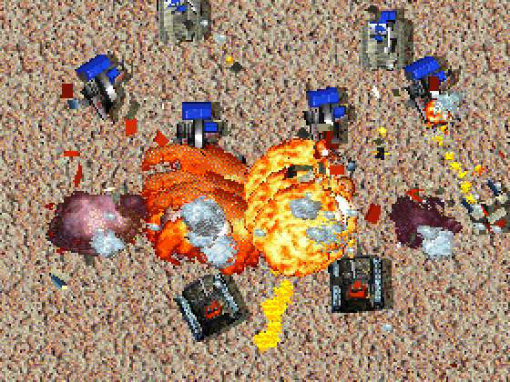
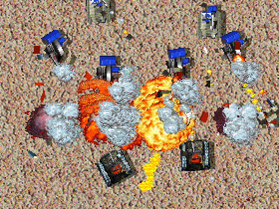

# Effects Tweaks

<!-- BEGIN GENERATED: facts -->
| Fact | Value |
| --- | --- |
| Hack id | `ui.effects-tweaks` |
| Area | Interface (`ui`) |
| Scope | view: local display only; each player may differ |
| Runs on | Each machine, for its own view. |
| Parameters | 2 |
| Status | implemented |
<!-- END GENERATED: facts -->

## Description

A weapon with `endsmoke=1` shows its explosion as well as its smoke puff
where it hits, and explosions no longer raise an extra column of smoke. In
3.1c an `endsmoke` weapon shows only the puff, and every explosion above
sea level raises a short smoke column.



*With the hack on, explosions raise no extra smoke column: the fireballs of a fight between Pyros and Stumpies on one side and PeeWees and Raiders on the other show clearly.*



*The same moment with the hack off: 3.1c's grey smoke columns rise over every explosion.*

## Configuration example

```yaml
hacks:
  ui.effects-tweaks: true
```

```yaml
hacks:
  # Show the endsmoke explosion, but keep the smoke column of every explosion.
  ui.effects-tweaks:
    explosion-smoke-puff: true
```

## Details

### Behaviour

- `endsmoke-explosion`: when a weapon with `endsmoke=1` goes off on land, or
  strikes a unit in water, it raises its white smoke puff and then also
  shows the weapon's own explosion animation. In 3.1c the puff alone shows
  and the explosion is skipped. A shot that goes off in water without
  striking a unit shows the water explosion either way.
- `explosion-smoke-puff`: true keeps 3.1c's short smoke column under every
  explosion that goes off above sea level and not underwater; false raises
  none.

The two parameters are separate; either may be set alone.

### Network games

Explosions and smoke are drawn by each machine for its own view; nothing
needs to agree between machines. They draw from this machine's own effect
random stream, not from the simulation's shared one, so the hack never
changes what the other machines compute. It does change the later effect
draws on this machine, since fewer or more effects take numbers from that
stream.

### Implementation notes

- `match_display_rules` in [src/app/view_rules.cpp](../../../src/app/view_rules.cpp)
  turns `ModProfile::ui.effects_tweaks` (`endsmoke_explosion`,
  `explosion_smoke_puff`) into the match's `DisplayRules`
  (`end_smoke_explosion`, `explosion_smoke_column`).
- The match applies them in
  [src/sim/match-runtime/src/effects.cpp](../../../src/sim/match-runtime/src/effects.cpp)
  (the weapon's burst) and through `EffectWorld::explosion_smoke_column` in
  [src/sim/effect-particles/src/explosions.cpp](../../../src/sim/effect-particles/src/explosions.cpp)
  (`log_explosion`).
- Tests: `app-view-rules` (`match_display_rules_follow_the_profile`),
  `match-effect-hooks` (the explosions under the tweaked rules),
  `effect-explosions` (`explosion_smoke_column_can_be_turned_off`).

## Full configuration schema

<!-- BEGIN GENERATED: schema -->
Hack id `ui.effects-tweaks`, written under the profile's `hacks` block.

| Write | Means |
| --- | --- |
| `ui.effects-tweaks: true` | On, every parameter at its default. |
| `ui.effects-tweaks: {endsmoke-explosion: true}` | On, the parameters named set and the rest at their defaults. |
| `ui.effects-tweaks: {preset: baseline}` | On, starting from a preset; parameters named beside `preset` replace its values. |
| `ui.effects-tweaks: false` | Off, the same as leaving it out: 3.1c behaviour. |

### Parameters

| Parameter | Type | Unit | Allowed | Length | Baseline (3.1c) | Default | Adjustable | Scope | Overridden by |
| --- | --- | --- | --- | --- | --- | --- | --- | --- | --- |
| `endsmoke-explosion` | `bool` | - | `true`, `false` | - | `false` | `true` | `fixed` | `view` | - |
| `explosion-smoke-puff` | `bool` | - | `true`, `false` | - | `true` | `false` | `fixed` | `view` | - |

Adjustable: `fixed`: only the profile sets it.

### Presets

| Preset | Values |
| --- | --- |
| `baseline` | `{endsmoke-explosion: false, explosion-smoke-puff: true}` |

`baseline` sets every parameter to its 3.1c value: the hack is on and plays as 3.1c.

### Shorthand

This hack takes no shorthand: write `true`, `false` or a parameter map.

### Every parameter at its default

```yaml
hacks:
  ui.effects-tweaks:
    endsmoke-explosion: true
    explosion-smoke-puff: false
```
<!-- END GENERATED: schema -->
