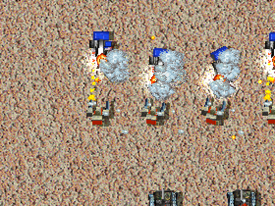
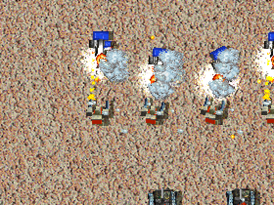

# Explosion Flash

<!-- BEGIN GENERATED: facts -->
| Fact | Value |
| --- | --- |
| Hack id | `ui.explosion-flash` |
| Area | Interface (`ui`) |
| Scope | view: local display only; each player may differ |
| Runs on | Each machine, for its own view. |
| Parameters | 1 |
| Status | implemented |
<!-- END GENERATED: facts -->

## Description

Sets the level a mod designs its explosions' flashes at: `full`, as 3.1c
draws them, `reduced`, at half their light, or `off`. In 3.1c every
explosion lights up the ground around it for under a second, brightest at
its centre, and a unit's death flashes once for each piece that bursts,
so a large battle can light the battlefield white.

The player's own Explosion flash setting ([Graphics](../../settings.md#graphics))
always wins when it is lower: the flash is drawn at the lower of the two
levels. A player can always reduce the flash or turn it off whatever the
mod asks, and a mod can reduce it but never draw it above the player's
choice.



*With the hack on at its default, `reduced`, the explosions of a fight between Pyros and Stumpies on one side and PeeWees and Raiders on the other light the sand at half strength.*



*The same moment with the hack off: 3.1c's full flashes.*

## Configuration example

```yaml
hacks:
  # Flashes at half their light; a player who chose Off sees none.
  ui.explosion-flash: true
```

```yaml
hacks:
  # No flashes, whatever the player's setting.
  ui.explosion-flash: off
```

## Details

### Behaviour

- Each flash pixel names a row of the light table (`palettes/PALETTE.LHT`)
  and lights the colour under it through that row: up to about twice as
  bright at the centre, fading to no change at the edge. Overlapping
  flashes light what the one before lit, so a cluster of them turns white.
- `full` draws the light table's rows as the flash names them; `reduced`
  halves each row, so the centre is about one and a half times as bright;
  `off` draws no flash.
- The level drawn is the lower of `level` and the player's Explosion flash
  setting. The hack off is the same as `full`: the player's setting alone
  decides.
- Only the drawing changes. The explosions, their records and their timing
  play out the same at every level, so nothing the game computes changes.

### Network games

Each machine draws the flashes for its own view, at its own player's
setting held to the profile's level; nothing needs to agree between
machines, and the profile's level is not part of the rules the machines
compare. The flash shows nothing the explosion itself does not: in 3.1c
neither waits for line of sight.

### Implementation notes

- `explosion_flash_drawn` in [src/app/view_rules.cpp](../../../src/app/view_rules.cpp)
  takes the lower of `ModProfile::ui.explosion_flash` and the player's
  `EngineSettings::explosion_flash`; the renderer
  ([src/app/runtime_match_render.cpp](../../../src/app/runtime_match_render.cpp))
  reads it as it plans each frame, and never the match.
- The processor draws each flash through the light table
  (`blit_world_lit_hotspot`, [src/app/world_draws.cpp](../../../src/app/world_draws.cpp));
  the graphics card lights by the light table's share without snapping to
  the palette ([src/app/runtime_full_sprites.cpp](../../../src/app/runtime_full_sprites.cpp)).
- Tests: `app-view-rules` (`explosion_flash_follows_the_lower_level`, every
  level of the profile against every level of the player's),
  `app-world-draws` (`test_explosion_flashes`), `app-card-frame`,
  `native-render-tiers` (the Full tier's flashes within their bounds of the
  processor's).

## Full configuration schema

<!-- BEGIN GENERATED: schema -->
Hack id `ui.explosion-flash`, written under the profile's `hacks` block.

| Write | Means |
| --- | --- |
| `ui.explosion-flash: true` | On, every parameter at its default. |
| `ui.explosion-flash: {level: reduced}` | On, the parameters named set and the rest at their defaults. |
| `ui.explosion-flash: {preset: baseline}` | On, starting from a preset; parameters named beside `preset` replace its values. |
| `ui.explosion-flash: reduced` | On, the shorthand: a bare value sets `level`. |
| `ui.explosion-flash: false` | Off, the same as leaving it out: 3.1c behaviour. |

### Parameters

| Parameter | Type | Unit | Allowed | Length | Baseline (3.1c) | Default | Adjustable | Scope | Overridden by |
| --- | --- | --- | --- | --- | --- | --- | --- | --- | --- |
| `level` | `enum` | - | `off`, `reduced`, `full` | - | `full` | `reduced` | `fixed` | `view` | - |

Adjustable: `fixed`: only the profile sets it.

### Presets

| Preset | Values |
| --- | --- |
| `baseline` | `{level: full}` |

`baseline` sets every parameter to its 3.1c value: the hack is on and plays as 3.1c.

### Shorthand

The hack has one parameter, so a bare value sets `level`: `ui.explosion-flash: reduced` is `ui.explosion-flash: {level: reduced}`.

### Every parameter at its default

```yaml
hacks:
  ui.explosion-flash:
    level: reduced
```
<!-- END GENERATED: schema -->
