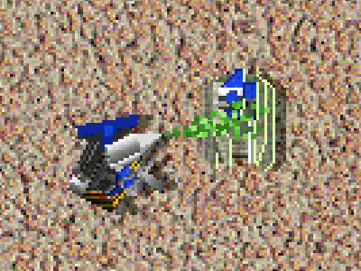
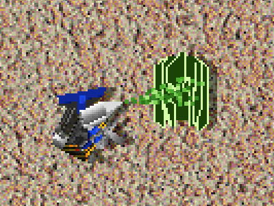

# Interface Fixes

<!-- BEGIN GENERATED: facts -->
| Fact | Value |
| --- | --- |
| Hack id | `ui.interface-fixes` |
| Area | Interface (`ui`) |
| Scope | view: local display only; each player may differ |
| Runs on | Each machine, for its own view. |
| Parameters | 1 |
| Status | implemented |
<!-- END GENERATED: facts -->

## Description

Corrects a set of small display faults in the 3.1c interface: range circles, the top panel's art, the cursor over air bases and after a unit dies, how unfinished mobile units are drawn, and one misspelled caption. The profile picks the fixes it wants from a list.



*As in 3.1c, an unfinished Stumpy placed on the map by a Construction Kbot has its moving pieces (the turret) drawn plain over its nanoframe.*



*With the nanoframe-raster fix, the same unfinished Stumpy is drawn wholly as nanoframe until it is built.*

## Configuration example

```yaml
hacks:
  ui.interface-fixes: true
```

```yaml
hacks:
  # Only these fixes; the shorthand sets the `fixes` list.
  ui.interface-fixes: [radius-0, bar-clamp, cursor-reset, build-toggle, resurrect-spelling]
```

## Details

Each member of `fixes` turns on one correction. Members left out keep
3.1c's behaviour, and the hack with an empty list plays as 3.1c.

| Member | With the fix | 3.1c |
| --- | --- | --- |
| `range-ring-3` | With range display on, a unit's third weapon draws its range circle when that weapon is enabled. | The third circle depends on the first weapon's enable bit, so it can be missing or shown for the wrong reason. |
| `radius-0` | A circle too small to draw a single segment (radius 0 or less) still draws its label. | Such a circle draws nothing, its label included. |
| `nanoframe-raster` | An unfinished mobile unit's moving pieces are drawn over its nanoframe only once it is built, as a building's are. | The moving pieces of an unfinished mobile unit are drawn plain over its nanoframe every frame. |
| `bar-clamp` | Top panel art as tall as the battlefield's top edge, or taller, is cut to one row less than that edge, so it never covers the battlefield's first row. | The art is drawn whole and can overlap the battlefield. |
| `pad-cursor` | A selected aircraft over one of its own air bases shows the load cursor. | It shows the unload cursor. |
| `cursor-reset` | When the unit the order panel shows no longer exists, an armed order, build placement included, is dropped. | The armed cursor stays after its unit is gone. |
| `build-toggle` | The order panel's toggle buttons answer a click while a build placement is armed. | Toggle buttons do not respond in build mode. |
| `downloadmenu-zero` | The build menus that units add at run time start from cleared memory. | Their storage starts uninitialised, so unused entries hold leftovers. |
| `resurrect-spelling` | A resurrection that cannot name its unit type speaks "Resurrection failed". | The caption reads "Ressurection failed". |

The default when the hack is `true` is every member except
`resurrect-spelling`, which a profile names on its own.

### In a network game

This is a view rule: it changes only what this machine shows and how its own input works, never what another machine is told. It is not part of the match hash, so players in one game may have it on, off or set differently without breaking the game.

### Related hacks

- [ui.click-snap](ui.click-snap.md) and [ui.build-tools](ui.build-tools.md)
  also act in build mode; `cursor-reset` drops their armed placement like
  any other.

### Implementation notes

The engine reads `UiRules::interface_fixes` (fields `enabled` and the
`fixes` set) through `Runtime::ui_rules` in
`src/app/runtime_engine_settings.cpp`:

| Member | Where it applies | Test |
| --- | --- | --- |
| `range-ring-3`, `radius-0` | `src/app/runtime_order_overlays.cpp` sets `third_ring_own_weapon` and `segmentless_circle_label` of the overlay context (`src/ui/hud/include/oa/ui/hud/order_overlays.hpp`) | `ui-hud-order-overlays` (`test_interface_fix_circles`) |
| `nanoframe-raster` | `src/app/runtime_match_render.cpp` sets the renderer's `moving_pieces_once_built` (`src/present/model/include/oa/present/model/model_draw.hpp`) | `model-render-model-draw` (`test_mobile_nanoframe_moving_pieces`) |
| `bar-clamp` | `src/app/runtime_match_menus.cpp` through `top_panel_rows` (`src/ui/hud/include/oa/ui/hud/resource_bar.hpp`) | `ui-hud-hud-labels` |
| `pad-cursor` | `src/app/runtime_pointer.cpp` sets the order cursor's `pad_load_cursor` (`src/sim/gameplay-input/include/oa/sim/gameplay_input/order_cursor.hpp`) | `gameplay-input-order-cursor` (`test_pad_cursor`) |
| `cursor-reset` | `src/app/runtime_match_render.cpp` through `panel_unit_vanished` (`src/ui/hud/include/oa/ui/hud/command_buttons.hpp`) | `ui-hud-command-buttons` (`vanished_panel_unit`) |
| `resurrect-spelling` | `src/app/runtime_skirmish_start.cpp` through `shown_unit_caption` (`src/ui/hud/include/oa/ui/hud/unit_labels.hpp`) | `ui-hud-hud-labels` (`test_resurrect_spelling`) |

Known limits:

- `build-toggle` is accepted but not read: the engine's order panel behaves
  the same whether it is listed or not.
- `downloadmenu-zero` is accepted but not read: the engine always clears
  the run-time build menu tables when it makes them
  (`src/data/defs/src/unit_catalog.cpp`), so it behaves as if the member
  were always listed.

## Full configuration schema

<!-- BEGIN GENERATED: schema -->
Hack id `ui.interface-fixes`, written under the profile's `hacks` block.

| Write | Means |
| --- | --- |
| `ui.interface-fixes: true` | On, every parameter at its default. |
| `ui.interface-fixes: {fixes: [range-ring-3, radius-0, nanoframe-raster, bar-clamp, pad-cursor, cursor-reset, build-toggle, downloadmenu-zero]}` | On, the parameters named set and the rest at their defaults. |
| `ui.interface-fixes: {preset: baseline}` | On, starting from a preset; parameters named beside `preset` replace its values. |
| `ui.interface-fixes: [range-ring-3, radius-0, nanoframe-raster, bar-clamp, pad-cursor, cursor-reset, build-toggle, downloadmenu-zero]` | On, the shorthand: a bare value sets `fixes`. |
| `ui.interface-fixes: false` | Off, the same as leaving it out: 3.1c behaviour. |

### Parameters

| Parameter | Type | Unit | Allowed | Length | Baseline (3.1c) | Default | Adjustable | Scope | Overridden by |
| --- | --- | --- | --- | --- | --- | --- | --- | --- | --- |
| `fixes` | `set<enum>` | - | `range-ring-3`, `radius-0`, `nanoframe-raster`, `bar-clamp`, `pad-cursor`, `cursor-reset`, `build-toggle`, `downloadmenu-zero`, `resurrect-spelling`; each at most once | any | `[]` | `[range-ring-3, radius-0, nanoframe-raster, bar-clamp, pad-cursor, cursor-reset, build-toggle, downloadmenu-zero]` | `fixed` | `view` | - |

Adjustable: `fixed`: only the profile sets it.

### Presets

| Preset | Values |
| --- | --- |
| `baseline` | `{fixes: []}` |

`baseline` sets every parameter to its 3.1c value: the hack is on and plays as 3.1c.

### Shorthand

The hack has one parameter, so a bare value sets `fixes`: `ui.interface-fixes: [range-ring-3, radius-0, nanoframe-raster, bar-clamp, pad-cursor, cursor-reset, build-toggle, downloadmenu-zero]` is `ui.interface-fixes: {fixes: [range-ring-3, radius-0, nanoframe-raster, bar-clamp, pad-cursor, cursor-reset, build-toggle, downloadmenu-zero]}`.

### Every parameter at its default

```yaml
hacks:
  ui.interface-fixes:
    fixes: [range-ring-3, radius-0, nanoframe-raster, bar-clamp, pad-cursor, cursor-reset, build-toggle, downloadmenu-zero]
```
<!-- END GENERATED: schema -->
