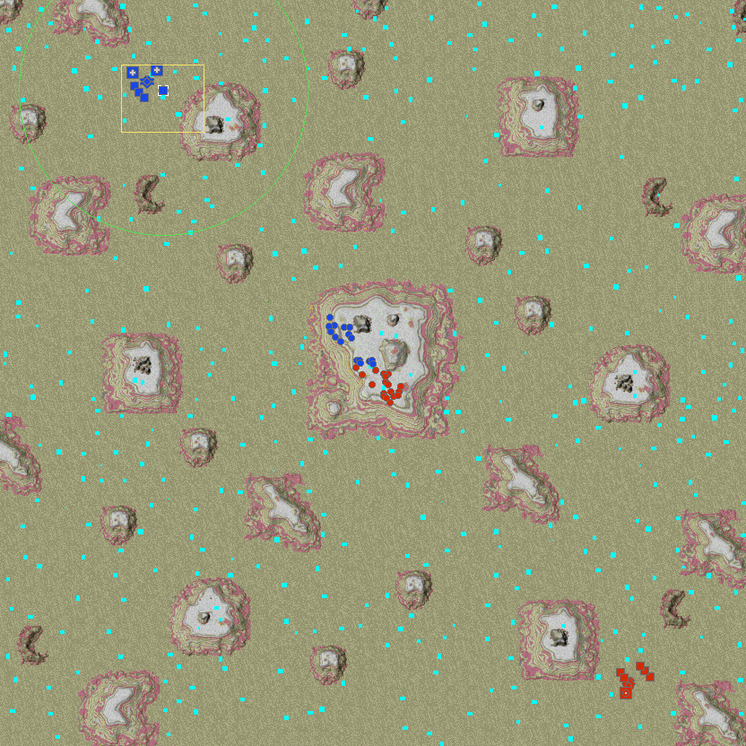
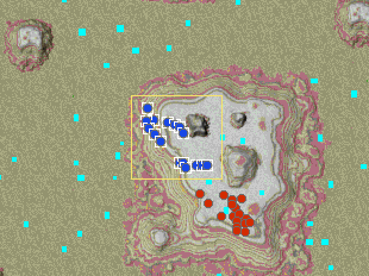
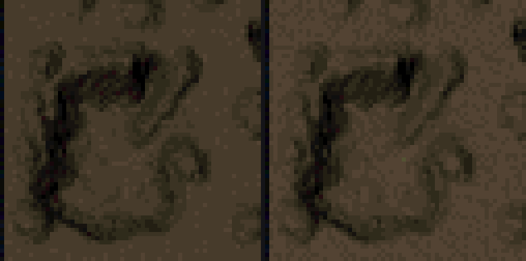

# Megamap

<!-- BEGIN GENERATED: facts -->
| Fact | Value |
| --- | --- |
| Hack id | `ui.megamap` |
| Area | Interface (`ui`) |
| Scope | view: local display only; each player may differ |
| Runs on | Each machine, for its own view. |
| Parameters | 5 |
| Status | implemented |
<!-- END GENERATED: facts -->

## Description

Adds a full-screen strategic map: Tab or the mouse wheel replaces the battlefield with the whole map, drawn with unit category icons, sensor rings and the main view's rectangle, and the player can select units and give orders on it. It can also redraw the minimap at a finer quality. 3.1c has only the minimap.



*The megamap open in the middle of a battle on Painted Desert: Arm (blue) and Core (red) unit icons meeting on the central plateau, the selected radar tower's radar ring, feature marks in cyan and the main view's rectangle.*



*Box-selecting an army on the megamap: the drag box drawn over the Arm army's icons, each unit inside marked selected with its white frame, the Core army below left unselected.*



*Close-up of the minimap on Fox Holes, enlarged 3x: left, 3.1c halves the map file's minimap through its palette pair-mix table and leaves stray reddish pixels along the craters' dark edges; right, ui.megamap's enhanced minimap averages each 2x2 block in full colour before picking the nearest palette colour, so the crater shading stays clean and the sand keeps its lighter tone.*

## Configuration example

```yaml
hacks:
  ui.megamap: true
```

```yaml
hacks:
  ui.megamap:
    enhanced-minimap: false          # keep the game's own minimap picture
    ring-minimums: [0, 0, 0, 0, 0]   # draw every sensor ring, however small
```

## Details

#### Opening and closing

Tab opens and closes the megamap, playing the interface's open and close
sounds. Rolling the wheel toward the player opens it; rolling it away closes
it and centres the battlefield view on the map point under the pointer.

#### What it shows

The megamap fills the battlefield's rectangle with the whole map, scaled to
fit with its proportions kept and bars on the long sides. Each pixel of the
picture takes the mean colour of the map pixels it covers, then the nearest
palette colour or, with `dither`, a checkerboard of the two nearest. The
picture is shaded by what the viewer has mapped and sees, as the minimap is.

With `feature-blobs`, the features the map placed are marked on the picture
as they stood at the start: features worth metal in one colour, spire
features in a second and the rest in a third, each at least one pixel.

Over the picture it draws:

- an icon for each unit the minimap shows, by category;
- the sensor and anti-nuke rings of the selected units;
- the main view's rectangle;
- a drag box while one is being drawn.

#### Icons

The icons come from the game folder's `Icon/iconcfg.ini`:

- `[Option]` holds `FillColor` (replaced by the owner's colour),
  `TransparentColor` (not drawn), `SelectedColor` (drawn only while the
  unit is selected), `HoverColor` (the selected colour's stand-in under the
  pointer), `UseCircleHover` (a ring marks the hovered unit instead) and
  `UseDefaultIcon` (use the built-in icon set rather than the file's lines).
- `[Icon]` holds one line per unit category word and its picture file,
  plus `Unknow`, `Nothing` and `NukeIcon`. Only the first `icon-categories`
  category lines are kept.

A unit out of the viewer's sight takes the `Nothing` icon. A seen unit takes
the first category line whose category holds its type, or the `Unknow` icon
when none does. An icon is at most 22 by 22 pixels; a missing picture draws
a square of the owner's colour. Without the file, the built-in set is used.

#### Rings

For each selected unit the megamap draws up to five rings, in this order:
radar, sonar, radar jammer, sonar jammer and interceptor coverage.
`ring-minimums` gives each kind's least radius in pixels, in the same order;
a ring is drawn when its range is above 0 and reaches its minimum.

#### Clicks

Clicks on the megamap act at the map point they stand for, and the orders
they give are ordinary orders:

- left click: without Shift the selection is cleared first; a click on one
  of the viewer's selectable units then flips it in or out of the
  selection;
- left drag (more than 3 pixels): box-select the viewer's selectable units,
  added to the selection while Shift is held;
- left double-click on a unit of the viewer's: select every unit of its type;
- right click: the default order, or the armed one, at that map point.

#### Enhanced minimap

With `enhanced-minimap`, the minimap's picture is redrawn by the same
downscaling at the minimap's own size, from the map file's minimap where it
has one, else from the map's terrain; `dither` applies to it too.

3.1c has no megamap and draws the minimap from the map file's picture as it
is. Turning the hack on with every parameter at its baseline gives a
megamap without icons, feature marks or the redrawn minimap, and only
interceptor rings of 512 pixels or more.

### In a network game

This is a view rule: it changes only what this machine shows and how its own input works, never what another machine is told. It is not part of the match hash, so players in one game may have it on, off or set differently without breaking the game.

Orders given on the megamap travel as any other order does.

### Related hacks

- [ui.camera-sharing](ui.camera-sharing.md) and
  [ui.allied-unit-display](ui.allied-unit-display.md) change what the
  minimap shows, and so which units the megamap draws.
- [ui.options-dialog](ui.options-dialog.md) keeps the megamap key with the
  player's settings; [console.key-remaps](console.key-remaps.md) moves keys
  that would clash with it.
- [ui.map-features-ignore-los](ui.map-features-ignore-los.md) decides
  whether map features are drawn out of sight on the battlefield.

### Implementation notes

- The engine reads `UiRules::megamap` (fields `enabled`,
  `enhanced_minimap`, `dither`, `feature_blobs`, `ring_minimums`,
  `icon_categories`).
- `src/app/runtime_megamap.cpp` opens, draws and clicks the megamap and
  redraws the enhanced minimap (`enhance_radar_picture`);
  `src/app/include/oa/app/megamap_state.hpp` holds what a match keeps for it.
- `src/ui/hud/include/oa/ui/hud/megamap.hpp` and `src/ui/hud/src/megamap.cpp`
  hold the layout and its two-way mapping, the terrain downscale, the
  feature colours, the icon file reader, the icon choice and recolouring,
  and the rings.
- Test: `ui-hud-megamap` (`src/ui/hud/tests/megamap_test.cpp`) covers the
  layout, the terrain downscale, the feature colours, the icon file, the
  icon choice and the ring minimums.

## Full configuration schema

<!-- BEGIN GENERATED: schema -->
Hack id `ui.megamap`, written under the profile's `hacks` block.

| Write | Means |
| --- | --- |
| `ui.megamap: true` | On, every parameter at its default. |
| `ui.megamap: {enhanced-minimap: true}` | On, the parameters named set and the rest at their defaults. |
| `ui.megamap: false` | Off, the same as leaving it out: 3.1c behaviour. |

### Parameters

| Parameter | Type | Unit | Allowed | Length | Baseline (3.1c) | Default | Adjustable | Scope | Overridden by |
| --- | --- | --- | --- | --- | --- | --- | --- | --- | --- |
| `enhanced-minimap` | `bool` | - | `true`, `false` | - | `false` | `true` | `fixed` | `view` | - |
| `dither` | `bool` | - | `true`, `false` | - | `false` | `false` | `fixed` | `view` | - |
| `feature-blobs` | `bool` | - | `true`, `false` | - | `false` | `true` | `fixed` | `view` | - |
| `ring-minimums` | `list<int>` | pixels | `0` to `65535` | 5 | `[0, 0, 0, 0, 512]` | `[128, 128, 64, 64, 512]` | `fixed` | `view` | - |
| `icon-categories` | `int` | categories | `0` to `64` | - | `0` | `9` | `fixed` | `view` | - |

Adjustable: `fixed`: only the profile sets it.

### Presets

This hack has no presets.

### Shorthand

This hack takes no shorthand: write `true`, `false` or a parameter map.

### Every parameter at its default

```yaml
hacks:
  ui.megamap:
    enhanced-minimap: true
    dither: false
    feature-blobs: true
    ring-minimums: [128, 128, 64, 64, 512]
    icon-categories: 9
```
<!-- END GENERATED: schema -->
