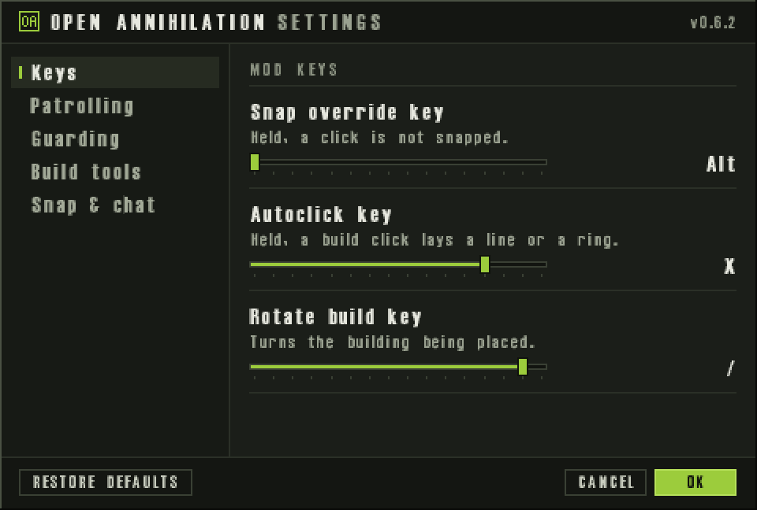
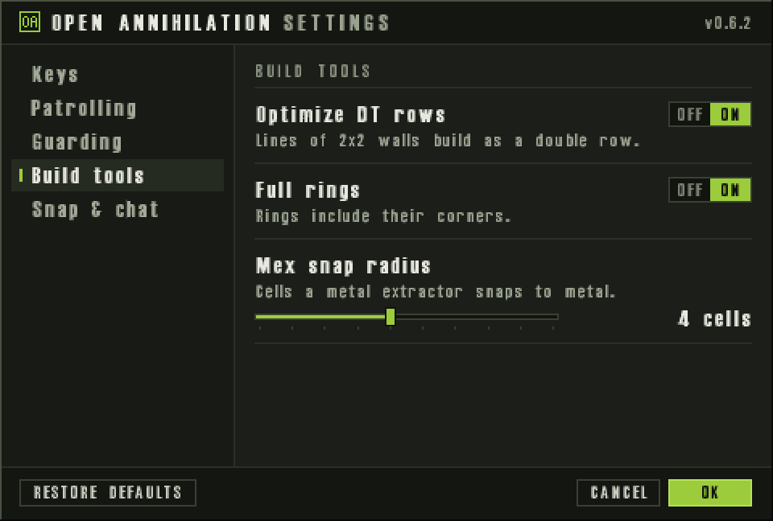

# Options Dialog

<!-- BEGIN GENERATED: facts -->
| Fact | Value |
| --- | --- |
| Hack id | `ui.options-dialog` |
| Area | Interface (`ui`) |
| Scope | view: local display only; each player may differ |
| Runs on | Each machine, for its own view. |
| Parameters | 0 |
| Status | implemented |
<!-- END GENERATED: facts -->

## Description

Adds an in-game options dialog on Ctrl+F2 where the player sets the keys, builder behaviour, snap radii and display switches that the other display hacks use, and a chat macro sent with F11. 3.1c has neither.



*Ctrl+F2 in a match opens the mod's settings dialog on its Keys section: the snap override, autoclick and rotate build keys.*



*The settings dialog's Build tools section: Optimize DT rows, Full rings and the mex snap radius.*

## Configuration example

```yaml
hacks:
  ui.options-dialog: true
```

## Details

#### The dialog

Ctrl+F2 in a match opens the settings dialog on the mod's own options,
beside the in-game menu. It lists five sections:

| Section | Settings | Choices |
| --- | --- | --- |
| Keys | Snap override key, Autoclick key, Rotate build key | one of the offered keys |
| Patrolling | Hold position, Maneuver, Roam | Reclaim only, Both, Assist only |
| Guarding | Hold position, Maneuver, Roam | Stay, Normal, Scatter |
| Build tools | Optimize DT rows, Full rings, Mex snap radius | Off or On; 0 to the profile's most cells |
| Snap & chat | Wreck snap radius, Accessible chat, Resource bar background | 0 to the profile's most cells; Off or On; None, Text or Solid |

A snap radius the profile gives no room shows "Set by the mod" and cannot
be changed. Changes take effect at once; OK keeps them with the player's
preferences and Cancel puts back what the dialog opened with. The
patrolling and guarding choices apply from the next game. Restore defaults
resets these options alone.

The whiteboard key, the megamap key, the build menu's facing display,
VSync and the chat macro's text are kept with the same settings but are not
in the dialog; they keep their stored values.

#### The chat macro

F11 in a match sends the chat macro: each non-empty line of it, split at
carriage returns and line feeds, is shown as a line on this machine only,
and a line starting with `+` is also run as a console command. The lines
are not relayed as chat to other players. The macro starts as:

```text
+setshareenergy 1000
+setsharemetal 1000
+shareall
+shootall
```

3.1c has no in-game options dialog for these settings and no chat macro.

### In a network game

This is a view rule: it changes only what this machine shows and how its own input works, never what another machine is told. It is not part of the match hash, so players in one game may have it on, off or set differently without breaking the game.

A console command the macro runs reaches other machines exactly as it would
if the player typed it.

### Related hacks

The dialog's settings are the ones these hacks use:
[ui.click-snap](ui.click-snap.md) (snap override key and radii),
[ui.build-tools](ui.build-tools.md) (autoclick key, Optimize DT rows, Full
rings, and the snap override key, held to drag one of the player's own
units ahead of its orders), [ui.build-preview](ui.build-preview.md) (rotate
build key, and the snap override key, held with the wheel to turn the
building),
[orders.con-patrol-guard-options](orders.con-patrol-guard-options.md)
(patrolling and guarding builders, applied only while that hack is on),
[ui.text-rendering](ui.text-rendering.md) (accessible chat),
[ui.resource-panel](ui.resource-panel.md) (panel background),
[ui.whiteboard](ui.whiteboard.md) and [ui.megamap](ui.megamap.md) (their
keys).

### Implementation notes

- The engine reads `UiRules::options_dialog` (field `enabled`).
- `src/app/runtime_engine_settings_match.cpp` opens the dialog on Ctrl+F2 as
  `DialogKind::mod_options`; `src/ui/engine-settings/src/dialog.cpp`
  (`open_mod_options_dialog`) lays it out.
- `src/app/view_rules.cpp` reads and writes the player's settings
  (`read_view_settings`, `write_view_settings`), builds the dialog's options
  and locks (`dialog_options`, `dialog_option_locks`), applies the choices
  (`apply_dialog_options`, `apply_builder_options`) and splits the macro
  (`chat_macro_lines`); `src/app/runtime_view_rules.cpp` takes F11.
- Tests: `app-view-rules` (`view_settings_round_trip`, `chat_helpers`,
  `options_dialog_round_trip`) and `ui-engine-settings-dialog`
  (`the_mod_options_dialog_lists_its_own_sections`).
- Known limits: VSync and the macro's text cannot yet be changed in the
  dialog.

## Full configuration schema

<!-- BEGIN GENERATED: schema -->
Hack id `ui.options-dialog`, written under the profile's `hacks` block.

| Write | Means |
| --- | --- |
| `ui.options-dialog: true` | On. |
| `ui.options-dialog: false` | Off, the same as leaving it out: 3.1c behaviour. |

### Parameters

This hack has no parameters.

### Presets

This hack has no presets.

### Shorthand

This hack has no parameters to set: write `true` or `false`.

### Every parameter at its default

```yaml
hacks:
  ui.options-dialog: true
```
<!-- END GENERATED: schema -->
