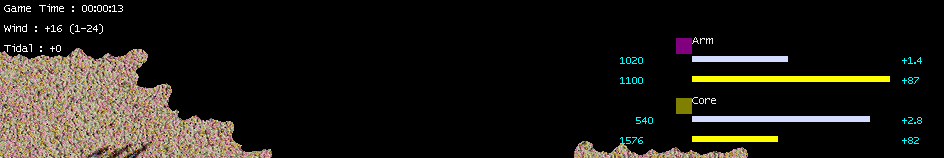
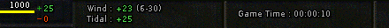

# Resource Panel

<!-- BEGIN GENERATED: facts -->
| Fact | Value |
| --- | --- |
| Hack id | `ui.resource-panel` |
| Area | Interface (`ui`) |
| Scope | view: local display only; each player may differ |
| Runs on | Each machine, for its own view. |
| Parameters | 0 |
| Status | implemented |
<!-- END GENERATED: facts -->

## Description

Adds a floating panel that lists allied players' stored resources, storage bars and incomes (every player's, for a watcher), and the wind, the tidal strength and the game time in the top bar, or on a window 1024 pixels wide or narrower at the battlefield's top left. A watcher can also switch to a player's view from the panel and follow that player's camera. 3.1c shows only the player's own resources.



*The floating resource panel lists each ally's stored metal and energy, storage bars and incomes.*

## Configuration example

```yaml
hacks:
  ui.resource-panel: true
```

## Details

#### The panel

The panel floats over the battlefield, first placed against the right edge
below the top panel; dragging it moves it. It lists player slots 1 to 9, in
slot order:

- a watcher sees every slot in use that has a name, their own included;
- anyone else sees the players whose machines report sharing their map
  position with this machine.

Each row shows the player's colour square, name, stored metal and energy,
a storage bar for each and both incomes:

- a stored amount is whole below 10000, thousands to one decimal with a K
  below 100000, and whole thousands with a K from there;
- a bar fills its share of 100 pixels, truncated, and shows at most 99;
- metal income has one decimal and energy income is whole, both with a
  plus sign.

The panel's background is the player's choice (none, behind the text, or
solid), set in the [options dialog](ui.options-dialog.md).

F4 shares the key with the game's statistics board: with the panel out and
the board away, F4 puts the panel away; with the panel away and the board
out, F4 brings the panel back; otherwise the key goes to the board.

#### The clock line

Three readings show:

- `Wind : +<now> (<least>-<most>)`, the energy a wind generator makes at
  the current strength and at the map's least and most, each rounded to
  nearest and at most the generator's output; a watcher sees only the
  range. The output is the base game's wind generator's, or 30 when the
  unit types name none;
- `Tidal : +<strength>`, truncated;
- `Game Time : hh:mm:ss`, at 30 ticks a second.

On a window wider than 1024 pixels the readings go in the top bar, in the
bar's font. There the bar runs on past its metal and energy readouts, its
art repeating in bevelled sections. Where it reaches far enough for two
sections, as at 1920x1080, the first holds the wind over the tidal
strength, their labels ending together, and the second holds the game
time. Labels, the wind's range and the time are light grey, and the signed
amounts the green of the produced rates, each sign against its figures.



Where the bar reaches far enough for one section, as at 1280x720 and
1366x768, the wind and the tidal strength keep their place and "Game Time"
goes over the time beside them.

On a window wider than 1024 pixels whose bar ends short of the two
sections, the side column, the minimap and both bars are drawn smaller,
just enough for the bar to reach 16 columns past the game time in the
second section, while that keeps them at least one and a half times the
size of the original 640x480 interface, as on a 1280x720 window. Where it
would not, they keep their size if the bar holds the game time beside the
wind and the tidal strength, and are otherwise drawn just small enough for
the bar to reach 16 columns past it. With the original game's fonts, a
window about 1450 pixels wide or wider gets the two sections, as 1600x900
and 1600x1200 do, and a narrower one the single section, as 4:3 and 5:4
windows from 1152x864 to 1400x1050 and 16:10 windows at 1280x800 and
1440x900 do. Clicks, the build menu and the minimap follow the smaller
interface, as on a smaller window. Without the hack, the interface keeps
its size. With HUD scaling Off in the settings the interface keeps the
original game's size, and its bar holds the two sections on every window
wider than 1024 pixels.

While the console's clock (`+clock`) shows the game time, the readings
leave it out: the top bar's first section holds the wind over the tidal
strength, and the interface is drawn smaller only as far as they need.
On a window 1024 pixels wide or narrower they go there too wherever the
bar already reaches past them, as at 1024x600, and at 800x600 and
1024x768 with HUD scaling Off; the interface keeps its size. Turned off
again, the game time comes back.

On a window 1024 pixels wide or narrower, and with the touch controls, the
readings are three plain lines under the top panel at the battlefield's
top left, the game time first. With the console's clock on, the wind and
the tidal strength take the first two where the top bar has no room for
them, as at 640x480 and on 4:3 windows with HUD scaling On.

#### Watcher view switching

In a game being watched or replayed, the watcher's double-click on the
panel switches views:

- on a row: the first double-click shows that player's view; a second one
  on the same row also locks the watcher's camera to that player's camera;
  a third one releases the camera;
- on the last row: back to the watcher's own view, which shows the whole
  map.

A row's number from 1 stands for the player slot of the same number,
whatever player the row shows. A slot that is not playing leaves the view
as it was but shows the whole map. Switching drops the selection and
redraws the panels and the sight. For a player, double-clicks on the panel
do nothing; view switching is for watchers and replays only.

3.1c shows only the player's own resources and has no clock line or view
switching.

### In a network game

This is a view rule: it changes only what this machine shows and how its own input works, never what another machine is told. It is not part of the match hash, so players in one game may have it on, off or set differently without breaking the game.

What the panel shows of other machines' players and cameras comes from what
those machines report; a game played alone reports nothing.

### Related hacks

- [ui.camera-sharing](ui.camera-sharing.md) carries the cameras the watcher's
  camera lock follows.
- [ui.allied-unit-display](ui.allied-unit-display.md) shows allied units on
  the minimap.
- [economy.deterministic-wind](economy.deterministic-wind.md) decides the
  wind the clock line reports.

### Implementation notes

- The engine reads `UiRules::resource_panel` (field `enabled`).
- `src/ui/hud/include/oa/ui/hud/resource_panel.hpp` and
  `src/ui/hud/src/resource_panel.cpp` hold the rows, number formats, bars,
  drawing, hits, F4 cycle, view switch decision and clock line formats.
- `src/app/runtime_view_panels.cpp` draws the panel and the clock line,
  takes the pointer and F4, follows a locked camera and switches the
  watcher's view.
- Test: `ui-hud-resource-panel` (`src/ui/hud/tests/resource_panel_test.cpp`:
  rows, formats, drawing, hits and switches, the F4 cycle, the clock line).
- A seated player's panel lists the players sharing their map position
  with this machine (`SharedPlayerViews::shares_position`, read by
  `resource_panel_rows`): the allies whose machines send their camera, as
  [ui.camera-sharing](ui.camera-sharing.md) describes. A watcher's panel
  lists every player in use.

## Full configuration schema

<!-- BEGIN GENERATED: schema -->
Hack id `ui.resource-panel`, written under the profile's `hacks` block.

| Write | Means |
| --- | --- |
| `ui.resource-panel: true` | On. |
| `ui.resource-panel: false` | Off, the same as leaving it out: 3.1c behaviour. |

### Parameters

This hack has no parameters.

### Presets

This hack has no presets.

### Shorthand

This hack has no parameters to set: write `true` or `false`.

### Every parameter at its default

```yaml
hacks:
  ui.resource-panel: true
```
<!-- END GENERATED: schema -->
