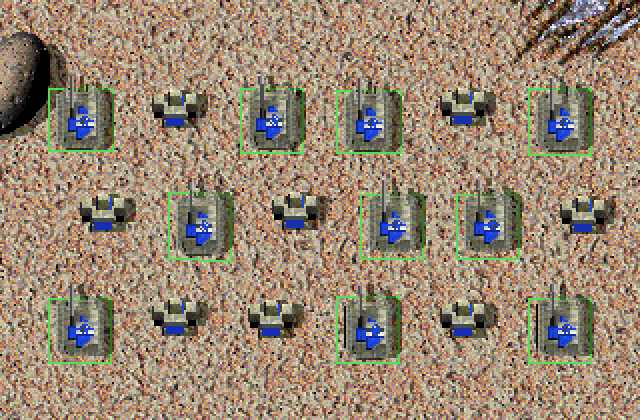

# Selection Shortcuts

<!-- BEGIN GENERATED: facts -->
| Fact | Value |
| --- | --- |
| Hack id | `ui.selection-shortcuts` |
| Area | Interface (`ui`) |
| Scope | view: local display only; each player may differ |
| Runs on | Each machine, for its own view. |
| Parameters | 1 |
| Status | implemented |
<!-- END GENERATED: facts -->

## Description

Adds selection shortcuts: a double-click selects every on-screen unit of the selected types, Ctrl+S, Ctrl+B and Ctrl+F select mobile combat units or cycle idle builders and factories, W, B and Y filter a drag box, and Ctrl with Shift steps a build queue by 100. 3.1c has none of these.



*A double-click on one Stumpy selects every Stumpy on screen, while the Peewees mixed in among them stay unselected.*

## Configuration example

```yaml
hacks:
  ui.selection-shortcuts: true
```

## Details

All shortcuts act on the local player's units in this machine's view.

#### Unit sets

The shortcuts pick from three sets of unit types:

- mobile combat units: the types in the `CTRL_W` category that do not fly;
- constructors: the types in `CTRL_B`, or, when no type is in it, the
  builders that move and are neither an air base nor a commander;
- factories: the types in `CTRL_F`, or, when no type is in it, the
  builders that do not move.

A commander is a type that both shows its player's name and hides its
damage.

#### Double-click

A double-click (left or right) on one of the local player's units gathers
the types of every selected unit, then replaces the selection with the
local player's finished, selectable units on screen of those types. It
drops the armed command. It does nothing while the game is paused, while
the megamap is open, or while the line-build key is held. With
[ui.build-tools](ui.build-tools.md) on, a left double-click on one of the
player's own mobile units with the snap override key held drags that unit
instead.

#### Ctrl+S, Ctrl+B, Ctrl+F

- Ctrl+S replaces the selection with the local player's finished mobile
  combat units on screen.
- Ctrl+B selects the next idle constructor and centres on it. A unit counts
  when its health is above 1 percent, it can move, its type is a
  constructor and its first order is none or standing by. The walk goes
  through the player's units by index from after the last one picked; past
  the end it starts again once from the beginning, so the player's first
  unit is never picked after the walk wraps, nor at the very start.
- Ctrl+F does the same for factories: a unit counts when it is selectable,
  finished, its type is a factory and its first order is not building.

Shift with these keys leaves them to the game.

#### Drag box filters

Holding W, B or Y as a drag box closes keeps only the mobile combat units,
constructors or factories of the box's selection; W wins over B, and B over
Y.

#### Queue step

A Shift-click on a build button adds or removes 100 instead of 5 while Ctrl
is held.

#### `same-type-bitset-fix`

This parameter makes Ctrl+Z, which adds every unit of the selected types
anywhere on the map, work with every unit type. Without it Ctrl+Z gathers
the selected types in a set of `limits.unit-types`' `bitset-bits` type ids
(512 in 3.1c), and a unit whose type id is past that set is neither matched
nor added; 3.1c itself fails there. With it, and the hack on, the set holds
every type id. The double-click's type set holds as many types as the
category masks.

3.1c has none of these shortcuts and steps a build queue by 5 with Shift.

### In a network game

This is a view rule: it changes only what this machine shows and how its own input works, never what another machine is told. It is not part of the match hash, so players in one game may have it on, off or set differently without breaking the game.

### Related hacks

- [ui.megamap](ui.megamap.md) has its own double-click selection on the
  megamap.
- [console.key-remaps](console.key-remaps.md) moves keys that would clash
  with these.
- [ui.build-tools](ui.build-tools.md) uses the line-build key that turns
  the double-click off.

### Implementation notes

- The engine reads `UiRules::selection_shortcuts` (fields `enabled` and
  `same_type_bitset_fix`); `src/app/runtime_hotkeys.cpp` reads the latter
  for Ctrl+Z.
- `src/sim/selection/include/oa/sim/selection/shortcuts.hpp` holds the
  sets, the selections, the idle cycles, the drag filters and the queue
  step.
- `src/app/runtime_selection_shortcuts.cpp` takes the double-click, the
  Ctrl keys and the drag filters; `src/app/runtime_events.cpp` routes the
  right double-click; `src/app/runtime_order_panel.cpp` sets the queue step.
- Tests: `sim-selection-shortcuts` (`src/sim/selection/tests/shortcuts_test.cpp`)
  and `ui-hud-order-panel` (the Ctrl queue step).

## Full configuration schema

<!-- BEGIN GENERATED: schema -->
Hack id `ui.selection-shortcuts`, written under the profile's `hacks` block.

| Write | Means |
| --- | --- |
| `ui.selection-shortcuts: true` | On, every parameter at its default. |
| `ui.selection-shortcuts: {same-type-bitset-fix: true}` | On, the parameters named set and the rest at their defaults. |
| `ui.selection-shortcuts: false` | Off, the same as leaving it out: 3.1c behaviour. |

### Parameters

| Parameter | Type | Unit | Allowed | Length | Baseline (3.1c) | Default | Adjustable | Scope | Overridden by |
| --- | --- | --- | --- | --- | --- | --- | --- | --- | --- |
| `same-type-bitset-fix` | `bool` | - | `true`, `false` | - | `false` | `true` | `fixed` | `view` | - |

Adjustable: `fixed`: only the profile sets it.

### Presets

This hack has no presets.

### Shorthand

This hack takes no shorthand: write `true`, `false` or a parameter map.

### Every parameter at its default

```yaml
hacks:
  ui.selection-shortcuts:
    same-type-bitset-fix: true
```
<!-- END GENERATED: schema -->
