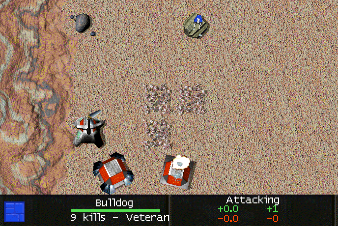

# Veterancy Label

<!-- BEGIN GENERATED: facts -->
| Fact | Value |
| --- | --- |
| Hack id | `ui.veterancy-label` |
| Area | Interface (`ui`) |
| Scope | view: local display only; each player may differ |
| Runs on | Each machine, for its own view. |
| Parameters | 0 |
| Status | implemented |
<!-- END GENERATED: facts -->

## Description

The unit panel labels a veteran unit's kill line with its veterancy level, "Vet1", "Vet2" and so on, from level 1 on. 3.1c shows "Veteran" from five kills on.


*A Bulldog that has destroyed nine wind generators: the unit panel's kill line reads "9 kills - Vet1".*



*The same unit with the hack off: 3.1c's "9 kills - Veteran".*

## Configuration example

```yaml
hacks:
  ui.veterancy-label: true
```

The hack takes no parameters. The levels follow the unit type's kill thresholds, which [veterancy.model](veterancy.model.md) and the `VeterancyThresholds` unit key set:

```yaml
hacks:
  veterancy.model: true
  ui.veterancy-label: true
```

## Details

**The level.** A unit's level L is the number of its type's kill thresholds that its kill count has reached. A count equal to a threshold reaches it. The thresholds come from the type's `VeterancyThresholds` key (the `veterancy.thresholds` data key) when it has one, else from `veterancy.model`'s `default-thresholds`. With the 3.1c list `[5, 10, 15, 20, 25]`, a unit reads Vet1 at 5 kills and Vet5 from 25 kills on.

**The line.** From level 1 on, the kill line reads `<n> kills - Vet<L>`, the noun always plural. Below level 1 it reads `<n> kills`, or `1 kill`, at any kill count. The nouns go through the language lookup; "Vet" does not.

**Quirks the engine reproduces.**

- The kill count is read as a signed 16-bit number. A count of 32768 or more is therefore above every threshold and reaches them all.
- The label has no cap of its own: a type with 32 thresholds can read up to Vet32. The caps of `veterancy.model` limit the bonuses, not the label.

**3.1c behaviour.** The kill line reads `<n> kills - Veteran` from 5 kills on, and `<n> kills` (or `1 kill`) below that.

**Network play.** Only this machine's display changes. Each player may turn it on or not; it is not part of the network hash.

**Interactions.** [veterancy.model](veterancy.model.md) decides the thresholds. Without it the `VeterancyThresholds` key is not read and the 3.1c thresholds apply. [ui.allied-unit-display](ui.allied-unit-display.md) decides whether an ally's kill line shows at all.

### Implementation notes

- The profile record is `ModProfile::ui.veterancy_label.enabled`. While it is set, `src/app/runtime_hud.cpp` gives the unit panel a `hud::UnitPanelHooks::veterancy_level` callback. The callback reads the type's thresholds from the match rules (`unit_type(t).veterancy_thresholds`, else `rules().veterancy.model.default_thresholds`).
- `veterancy_label_level` and `format_kill_count_at_level` in `src/ui/hud/src/unit_labels.cpp` count the level and write the line; `src/ui/hud/src/unit_panel.cpp` uses them. Without the callback the panel writes 3.1c's line (`format_kill_count`).
- Tests: `ui-hud-hud-labels` (levels, the signed count, the line) and `ui-hud-unit-panel` (the callback labels the kill line).

## Full configuration schema

<!-- BEGIN GENERATED: schema -->
Hack id `ui.veterancy-label`, written under the profile's `hacks` block.

| Write | Means |
| --- | --- |
| `ui.veterancy-label: true` | On. |
| `ui.veterancy-label: false` | Off, the same as leaving it out: 3.1c behaviour. |

### Parameters

This hack has no parameters.

### Presets

This hack has no presets.

### Shorthand

This hack has no parameters to set: write `true` or `false`.

### Every parameter at its default

```yaml
hacks:
  ui.veterancy-label: true
```
<!-- END GENERATED: schema -->
