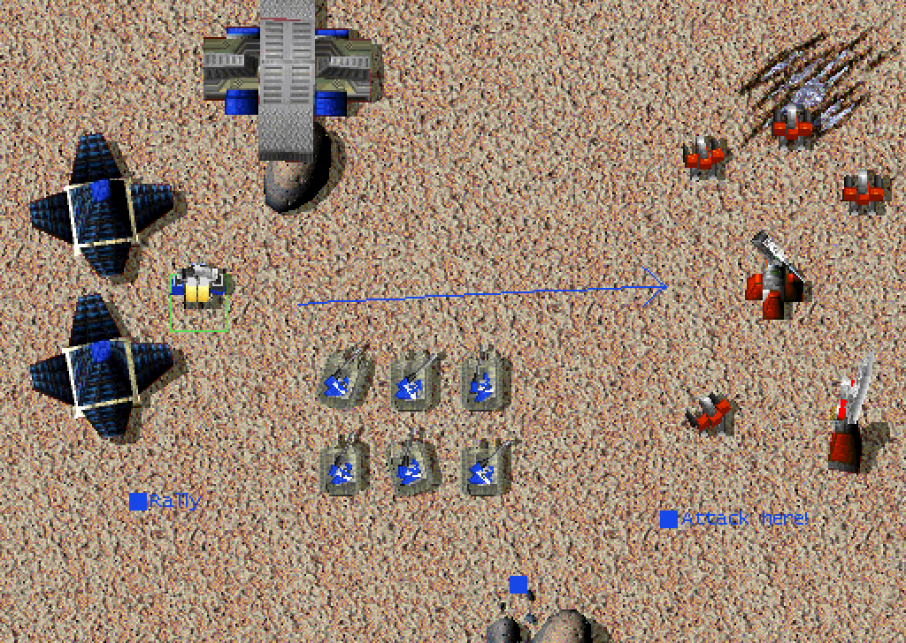
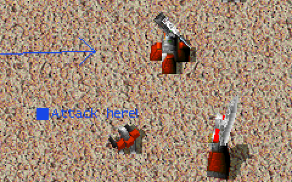

# Whiteboard

<!-- BEGIN GENERATED: facts -->
| Fact | Value |
| --- | --- |
| Hack id | `ui.whiteboard` |
| Area | Interface (`ui`) |
| Scope | view: local display only; each player may differ |
| Runs on | Each machine, for its own view. |
| Parameters | 0 |
| Status | implemented |
<!-- END GENERATED: facts -->

## Description

Allies can draw lines, dots and text markers on the battlefield to plan together. Markers another player places are echoed to the chat, and a key moves the view to the newest one. 3.1c has no whiteboard.



*An attack plan drawn on the battlefield: a line with an arrowhead from the Arm base toward a Core outpost, a marker labelled "Attack here!" beside the outpost, a "Rally" marker by the base and a plain dot.*



*Close-up of a whiteboard marker: the blue "Attack here!" marker and the arrow's head among the Core outpost's laser tower, radar and kbots.*

## Configuration example

```yaml
hacks:
  ui.whiteboard: true
```

The hack takes no parameters.

## Details

**Drawing.** The player holds the backslash key (`\`) with the pointer over the battlefield. All positions are map pixels, and every mark takes the drawing player's dot colour.

| Input while `\` is held | Effect |
| --- | --- |
| Left drag | Draws a line along the pointer's path. |
| Left press on a marker, then drag | Moves the marker. A press lands on the last placed marker within 10 pixels. |
| Left double-click | Opens a text editor on the marker there, or at that spot for a new marker. Enter or Escape closes it and keeps the text. A marker's text holds up to 64 bytes. |
| Middle button release | Places a dot (a marker without text). |
| Right drag | Area erase: around each point of the path, removes marks within 50 pixels. |
| Right double-click | Spot erase: removes marks within 10 pixels. |
| Ctrl+`\` | Centres the view on the newest marker another player sent. |

An erase square counts its near edges and leaves out its far edges. It removes a line whose first end lies inside it, and a marker whose place lies inside it. Drawing and erasing stop while the full-screen map of [ui.megamap](ui.megamap.md) is open, and a watcher cannot draw.

**Showing the marks.** A line is drawn when either end lies within 75 map pixels of the view. A marker is a 10-pixel square with its text to the right.

**Records.** Each edit queues one record for the other machines. A record starts with its type byte and a pad byte. Coordinates are 16-bit little-endian words:

| Type | Record | Fields after type and pad | Bytes |
| --- | --- | --- | --- |
| 1 | Line | x1, y1, colour, pad, x2, y2 | 12 |
| 3 | Marker | x, y, colour, text ending in a NUL (empty for a dot) | 8 + text |
| 5 | Edit text | x, y of the marker, its new text ending in a NUL | 7 + text |
| 6 | Move | old x, old y, colour, pad, new x, new y | 12 |
| 10 | Spot erase | x, y | 6 |
| 11 | Area erase | x, y | 6 |

Records go out in batches. A batch starts with a byte counting its records. A marker or edit-text record goes in a batch alone. Other records are packed while the batch holds fewer than 87 bytes, so a batch never exceeds 99 bytes.

**Receiving.** A received batch applies each record it holds whole; a batch cut short applies only the whole records. A received marker becomes the newest received marker, the one Ctrl+`\` goes to. It is also echoed to the chat as `*<player>: <text>`, or `*<player> added a new marker` for a dot. The player is the one with the marker's colour; when no player has that colour, nothing is echoed.

**3.1c behaviour.** There is no whiteboard, and the backslash key is a repeat key. [console.key-remaps](console.key-remaps.md) frees the key for the whiteboard.

**Network play.** The marks are view state, not simulation, and are not part of the network hash. They travel only between machines that present the recorder ([recorder.ta-demo-recorder](recorder.ta-demo-recorder.md)).

- **Sending.** Each frame, every batch drawn since the last frame goes out as the recorder's message of kind 0: the bytes `fb`, the batch's length, `00`, then the batch itself, count byte first. A batch travels alone in a frame of its own, once to each other player still in the game whose machine runs recorder protocol 2 or later. A player that presents no recorder, or an older one, is sent nothing.
- **Receiving.** A machine shows a player's batch only while that player allies its player: the player's last alliance change toward it, or the alliances the battle room set, made them allies, or, with [sharing.recorder-take-give](sharing.recorder-take-give.md), the player typed `.give` naming its player. It drops every other batch, and any batch longer than 100 bytes. A machine whose profile leaves the whiteboard off shows no batch.
- **Recordings.** A recording keeps the batches sent and received among the other records.

### Implementation notes

- The profile record is `ModProfile::ui.whiteboard.enabled`.
- `src/ui/hud/include/oa/ui/hud/whiteboard.hpp` and `src/ui/hud/src/whiteboard.cpp` hold the marks, make the records and batches, and apply received batches.
- `src/app/runtime_whiteboard.cpp` takes the pointer, keys and text, and draws the marks. It also makes and applies batches through `Runtime::take_whiteboard_batch` and `Runtime::receive_whiteboard_batch`.
- `NetworkPlay::net_frame` (`src/app/netgame/runtime_net.cpp`) sends each frame's batches with `net_match_send_whiteboard`, and the match's `whiteboard_marks` hook hands it the batches to show (`src/netgame/match/include/oa/netgame/match/net_match.hpp`). The match decides which batches are shown, in `handle_recorder_record` (`src/netgame/match/src/net_match.cpp`).
- Tests:
  - `ui-hud-whiteboard` covers the records, batches, receiving and echo, erase squares and marker hits.
  - `whiteboard_marks_reach_allies` in `src/netgame/match/tests/net_match_test.cpp` (ctest `net-match`) covers the message bytes, its frame of its own, who it goes to, and which batches are shown.
  - `native-net-loopback-whiteboard` plays a network game between two engines in one process under a profile with the recorder and this hack on: a line and a marker the host draws reach the joiner while the host allies it, with the marker echoed to its log, and stay away once the alliance is broken.
- **Known limits:**
  - A recording played back does not show the marks it holds.
  - The view settings keep a `WhiteboardKey` value, but the match reads the backslash key itself.

## Full configuration schema

<!-- BEGIN GENERATED: schema -->
Hack id `ui.whiteboard`, written under the profile's `hacks` block.

| Write | Means |
| --- | --- |
| `ui.whiteboard: true` | On. |
| `ui.whiteboard: false` | Off, the same as leaving it out: 3.1c behaviour. |

### Parameters

This hack has no parameters.

### Presets

This hack has no presets.

### Shorthand

This hack has no parameters to set: write `true` or `false`.

### Every parameter at its default

```yaml
hacks:
  ui.whiteboard: true
```
<!-- END GENERATED: schema -->
