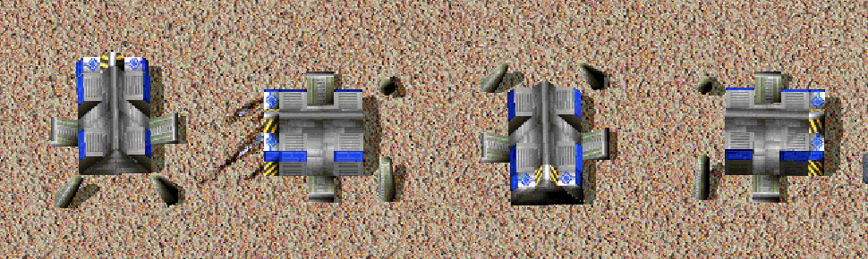

# Build Rotation

<!-- BEGIN GENERATED: facts -->
| Fact | Value |
| --- | --- |
| Hack id | `units.build-rotation` |
| Area | Units (`units`) |
| Scope | sim: part of the profile hash; every machine must agree |
| Runs on | Every machine in the game. |
| Parameters | 0 |
| Status | implemented |
<!-- END GENERATED: facts -->

## Description

Buildings whose unit definition allows it can be placed facing east, north or west as well as south. The facing turns the building's yardmap and footprint. In 3.1c every building faces south.



*Four Vehicle Plants, finished, facing (left to right) south, east, north and west; east and west swap the footprint's width and depth.*

## Configuration example

```yaml
hacks:
  units.build-rotation: true
```

The hack takes no parameters. Each building type lists its facings in its unit definition's `Rotations` key, letters from `S`, `E`, `N` and `W`:

```ini
[UNITINFO]
	{
	Rotations=SENW;
	}
```

## Details

**Which facings a type takes.** The `Rotations` key (the `units.build-facings` data key) is read only while the hack is on. Its letters may be upper or lower case, and a type without the key faces south. An unknown letter is reported as a data problem. A type may take a facing other than south only when all of these hold:

- it is a building (BMcode 0);
- its yard has as many cells as its footprint;
- its footprint is at most 32 cells wide and 32 deep;
- its `Rotations` letters name that facing.

A facing the type may not take places it facing south.

**Turning.** A facing counts quarter turns from south: 0 south, 1 east, 2 north, 3 west. East and west swap the footprint's width and depth. The yard is turned to match, and the engine turns each type's yard once per match for each facing. Occupancy, building-site tests, footprint height and the construction order's nanoframe all use the turned footprint and yard.

**The facing lives in the heading.** A building created with a facing has `facing << 14` added to its heading before it takes its place. The facing is read back from a heading as `((heading + 0xA000) >> 14) & 3`, so headings `0x6000` to `0x9FFF` read as south. The result is then limited to the facings the type may take. A unit's facing counts only while its footprint matches that facing's footprint; otherwise the unit faces south. Because the facing is in the heading:

- another machine reads it from the heading of the unit-create record (`0x09`);
- a resurrected building takes the heading of its wreck;
- a loaded save takes the saved heading;
- a building handed to another player keeps its facing.

**Build orders.** A build order carries the facing the player chose when placing it, and the builder builds the building in that facing. The build cursor offers only the facings the type may take, so the cursor's footprint, the ghost and the building agree. Computer players place every building facing south.

**Saved games.** A building keeps its facing in its saved heading. A build order's facing is not saved: a building whose construction had not started when the game was saved is built facing south after loading.

**3.1c behaviour.** Every building faces south, and the `Rotations` key is not read.

**Network play.** The owner's machine creates the building and sends its heading, facing included, in the unit-create record. Every machine reads the facing back from the heading, so every machine must run the hack and load the same `Rotations` data. The hack is part of the network hash.

**Interactions.**

- [ui.build-preview](ui.build-preview.md) gives the player the rotate key, and the wheel while the snap override key is held, shows the facing on the building's ghost and puts the chosen facing into the build order. Without it, a player places every building facing south.
- [ui.build-tools](ui.build-tools.md) lays lines and rings of turned footprints, and a ring around a building facing east or west follows its turned footprint.
- Only buildings turn, so mobile units placed through [units.placement-by-builder](units.placement-by-builder.md) and [units.mobile-unit-yardmap](units.mobile-unit-yardmap.md) face south.
- Structures given under [sharing.structure-gift-rate-limit](sharing.structure-gift-rate-limit.md) keep their facing.

### Implementation notes

- The profile record is `rules().units.build_rotation.enabled`, with each type's facings in `unit_type(t).build_facings`. `src/data/defs/src/rule_keys.cpp` reads the `Rotations` key.
- `Match::keep_unit_rules` in `src/sim/match-runtime/src/unit_rules.cpp` turns the yards. The same file holds `Match::build_facing`, `build_facings`, `build_facing_of_heading`, `unit_build_facing`, `build_yard` and `set_build_facing`.
- `src/sim/unit-spawn/src/spawn.cpp` swaps the footprint and adds the facing to the heading.
- The facing is applied in several places:
  - building sites: `src/sim/match-runtime/src/tick_construction.cpp`;
  - construction: `tick_host_construction.cpp` and `tick_missions_build.cpp`;
  - resurrection: `tick_missions_ground.cpp`;
  - transfers: `tick_damage.cpp`;
  - remote creation: `src/netgame/match/src/match_binding.cpp`;
  - loaded saves: `src/app/runtime_saveload.cpp`.
- The player's build order carries the facing. `Runtime::place_pending_build_at` in `src/app/runtime_match_hud.cpp` gives `Match::issue_mobile_build` (`src/sim/match-runtime/src/tick_orders.cpp`) the facing chosen under [ui.build-preview](ui.build-preview.md), for every site the build cursor places, alone, snapped or along a line or ring. A ground or air builder then builds the building in that facing, and a ground builder whose turned site is blocked under [orders.build-site-kickout](orders.build-site-kickout.md) clears the turned footprint. `Match::set_build_facing` changes the facing of an order already given.
- `Runtime::pending_build_facings` (`src/app/runtime_view_rules.cpp`) offers the facings `Match::build_facings` lists for the type. `Runtime::lay_build_tool` turns the footprint a ring goes around by `Match::unit_build_facing`.
- The owner's unit-create record carries the unit's heading (`net_match_send_unit_created` in `src/netgame/match/src/net_match.cpp`).
- Tests: `match-unit-rules` (`buildings_turn_with_the_rule`, with the facings the cursor offers; `builder_builds_in_the_order_facing`, with the facing given with the order and set after it; `kickout_clears_the_turned_footprint`), `net-match-runtime` (`turned_buildings_reach_the_copy`) and `app-view-rules` (`build_facings`, the rotate order).

## Full configuration schema

<!-- BEGIN GENERATED: schema -->
Hack id `units.build-rotation`, written under the profile's `hacks` block.

| Write | Means |
| --- | --- |
| `units.build-rotation: true` | On. |
| `units.build-rotation: false` | Off, the same as leaving it out: 3.1c behaviour. |

### Parameters

This hack has no parameters.

### Presets

This hack has no presets.

### Shorthand

This hack has no parameters to set: write `true` or `false`.

### Data keys

These data keys are read only while the hack is on:

| Data key | File | Usual key | Overrides |
| --- | --- | --- | --- |
| `units.build-facings` | unit | `Rotations` | - |

### Every parameter at its default

```yaml
hacks:
  units.build-rotation: true
```
<!-- END GENERATED: schema -->
