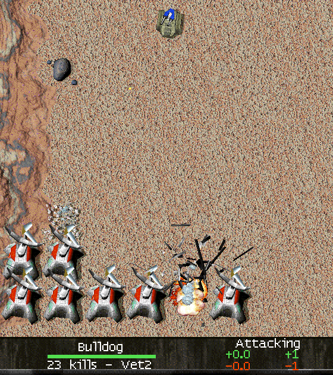

# Veterancy Model

<!-- BEGIN GENERATED: facts -->
| Fact | Value |
| --- | --- |
| Hack id | `veterancy.model` |
| Area | Veterancy (`veterancy`) |
| Scope | sim: part of the profile hash; every machine must agree |
| Runs on | The machine that owns the unit or player concerned. |
| Parameters | 11 |
| Status | implemented |
<!-- END GENERATED: facts -->

## Description

Sets how a unit's kills become veterancy levels and what each level does. With the hack on, levels come from kill thresholds that each unit type can set, and the bonuses to damage, armour, reload, aim lead, accuracy and capture time follow the parameters instead of 3.1c's fixed rules (a level per 5 kills, at most 5 levels).



*In a mod that gives the Bulldog its own VeterancyThresholds (10 20 30 40 50 kills), its level comes from them: at 23 kills the panel reads "Vet2", where 3.1c's one level per five kills would give Vet4.*

## Configuration example

```yaml
hacks:
  veterancy.model: true
```

```yaml
hacks:
  veterancy.model:
    preset: baseline              # count levels as 3.1c does...
    damage-dealt-per-level: 10    # ...but each level adds 10 % damage instead of 6 %
```

## Details

### Levels

A unit counts its kills (a 16-bit count). Its level L comes from `level-source`:

- `kills-div-5`: L = kills / 5, as in 3.1c.
- `thresholds`: L is the number of thresholds at or below the kill count. The thresholds are the unit type's own `VeterancyThresholds` list (data key `veterancy.thresholds`) when it has one, otherwise `default-thresholds`. Under this source the count is read as a signed 16-bit number widened and compared without sign, so a count above 32767 lies past every threshold.

### Effects of a level

Each effect uses L limited by its own cap:

| Effect | Rule |
| --- | --- |
| Damage taken | multiplied by (100 − `damage-taken-per-level` × min(L, `damage-taken-cap`)) %, never below 0 % |
| Damage dealt | multiplied by (100 + `damage-dealt-per-level` × min(L, `damage-dealt-cap`)) %; `none` leaves it uncapped |
| Reload time | multiplied by (100 − `reload-per-level` × min(L, `reload-cap`)) %, never below 0 %, before the usual health factor |
| Aim lead | with `lead-after: kills-gt-5` a unit leads moving targets once it has more than 5 kills; with `first-threshold`, once its kills pass the first threshold of its type (never, for an empty list) |
| Accuracy | the weapon spread is divided by kills / rate, where rate is the type's `VeterancyAccuracyBuffRate` (data key `veterancy.accuracy-rate`) or `accuracy-rate-default`; a rate of 0 gives no accuracy bonus. It uses raw kills, so accuracy keeps improving past the last threshold |
| Capture time | the level added to the capture base (see below) |

With `damage-taken-per-level: 4`, a unit at 25 levels takes no damage.

### Capture level

The time to capture a unit grows with its level. `capture-level` chooses that level:

- `kills-div-5`: kills / 5, as in 3.1c.
- `extended`: 0 below the first threshold; the number of thresholds reached up to the last one; past the last threshold, the count of thresholds plus (kills − last) / (last − previous), so levels keep rising at the last step's spacing. A list of one threshold gives kills / threshold; a zero step or zero threshold gives the count of thresholds.

### Baseline

3.1c gives a level per 5 kills and caps every effect at 5 levels: −4 % damage taken, +6 % damage dealt and −6 % reload time per level, aim lead after 5 kills, accuracy divisor kills / 12, and capture level kills / 5. The `baseline` preset is exactly these values, so a profile can start from it and change one parameter.

### Network games

The shooter's machine works out a hit: it scales the damage by the shooter's damage-dealt bonus and by the victim's damage-taken reduction, using the victim's own type thresholds, before the hit is shared. Every machine must therefore agree on the parameters and on every unit type's thresholds and accuracy rate (the unit files must match).

### Interactions

- [`ui.veterancy-label`](ui.veterancy-label.md) shows the level in the unit panel and reads the same thresholds.
- [`repair.rate`](repair.rate.md) and [`repair.healtime-self-heal`](repair.healtime-self-heal.md) change healing, not veterancy; they share the same tests.

### Implementation notes

- `src/sim/unit-health/src/veterancy.cpp` (declared in `src/sim/unit-health/include/oa/sim/unit_health/veterancy.hpp`) turns kills into the level and each effect. It reads the rules record `veterancy.model` (`VeterancyModel`) and each type's `veterancy_thresholds` and `veterancy_accuracy_rate` through `MatchRulesView`. With the hack off the record holds the baseline values, so the same code gives 3.1c's results.
- The effects are applied in `src/sim/unit-health/src/unit_health.cpp` (damage taken), `src/sim/weapon-execution/src/weapon_launch.cpp` (damage dealt, accuracy spread and lead), `src/sim/weapon-execution/src/weapon_execution.cpp` (`reload_ticks_after_shot`) and `src/sim/match-runtime/src/tick_missions_build.cpp` (capture).
- Tested by `unit-health-veterancy` (levels, caps, each parameter alone, counts past 32767, extended capture edges, the victim's thresholds), `match-veterancy-repair` (`veteran_shot_scales_by_both_types`), `weapon-launch` (`veterancy_rules_scale_shots`) and `data-mod-profile` (presets with parameters beside them, `none`, list validation).

## Full configuration schema

<!-- BEGIN GENERATED: schema -->
Hack id `veterancy.model`, written under the profile's `hacks` block.

| Write | Means |
| --- | --- |
| `veterancy.model: true` | On, every parameter at its default. |
| `veterancy.model: {level-source: thresholds}` | On, the parameters named set and the rest at their defaults. |
| `veterancy.model: {preset: baseline}` | On, starting from a preset; parameters named beside `preset` replace its values. |
| `veterancy.model: false` | Off, the same as leaving it out: 3.1c behaviour. |

### Parameters

| Parameter | Type | Unit | Allowed | Length | Baseline (3.1c) | Default | Adjustable | Scope | Overridden by |
| --- | --- | --- | --- | --- | --- | --- | --- | --- | --- |
| `level-source` | `enum` | - | `kills-div-5`, `thresholds` | - | `kills-div-5` | `thresholds` | `fixed` | `sim` | - |
| `default-thresholds` | `list<int>` | kills | `0` to `65535`; ascending | 1 to 32 | `[5, 10, 15, 20, 25]` | `[5, 10, 15, 20, 25]` | `fixed` | `sim` | unit key `veterancy.thresholds` (usually `VeterancyThresholds`) |
| `damage-taken-per-level` | `int` | percent | `0` to `25` | - | `4` | `4` | `fixed` | `sim` | - |
| `damage-dealt-per-level` | `int` | percent | `0` to `100` | - | `6` | `6` | `fixed` | `sim` | - |
| `reload-per-level` | `int` | percent | `0` to `16` | - | `6` | `6` | `fixed` | `sim` | - |
| `damage-taken-cap` | `int` | levels | `0` to `25` | - | `5` | `25` | `fixed` | `sim` | - |
| `damage-dealt-cap` | `int-or-none` | levels | `0` to `1000`; or `none` | - | `5` | `none` | `fixed` | `sim` | - |
| `reload-cap` | `int` | levels | `0` to `16` | - | `5` | `16` | `fixed` | `sim` | - |
| `lead-after` | `enum` | - | `kills-gt-5`, `first-threshold` | - | `kills-gt-5` | `first-threshold` | `fixed` | `sim` | - |
| `accuracy-rate-default` | `int` | kills | `0` to `65535` | - | `12` | `12` | `fixed` | `sim` | unit key `veterancy.accuracy-rate` (usually `VeterancyAccuracyBuffRate`) |
| `capture-level` | `enum` | - | `kills-div-5`, `extended` | - | `kills-div-5` | `extended` | `fixed` | `sim` | - |

Adjustable: `fixed`: only the profile sets it.

### Presets

| Preset | Values |
| --- | --- |
| `baseline` | `{level-source: kills-div-5, default-thresholds: [5, 10, 15, 20, 25], damage-taken-per-level: 4, damage-dealt-per-level: 6, reload-per-level: 6, damage-taken-cap: 5, damage-dealt-cap: 5, reload-cap: 5, lead-after: kills-gt-5, accuracy-rate-default: 12, capture-level: kills-div-5}` |

`baseline` sets every parameter to its 3.1c value: the hack is on and plays as 3.1c.

### Shorthand

This hack takes no shorthand: write `true`, `false` or a parameter map.

### Data keys

These data keys are read only while the hack is on:

| Data key | File | Usual key | Overrides |
| --- | --- | --- | --- |
| `veterancy.thresholds` | unit | `VeterancyThresholds` | `default-thresholds` |
| `veterancy.accuracy-rate` | unit | `VeterancyAccuracyBuffRate` | `accuracy-rate-default` |

### Every parameter at its default

```yaml
hacks:
  veterancy.model:
    level-source: thresholds
    default-thresholds: [5, 10, 15, 20, 25]
    damage-taken-per-level: 4
    damage-dealt-per-level: 6
    reload-per-level: 6
    damage-taken-cap: 25
    damage-dealt-cap: none
    reload-cap: 16
    lead-after: first-threshold
    accuracy-rate-default: 12
    capture-level: extended
```
<!-- END GENERATED: schema -->
